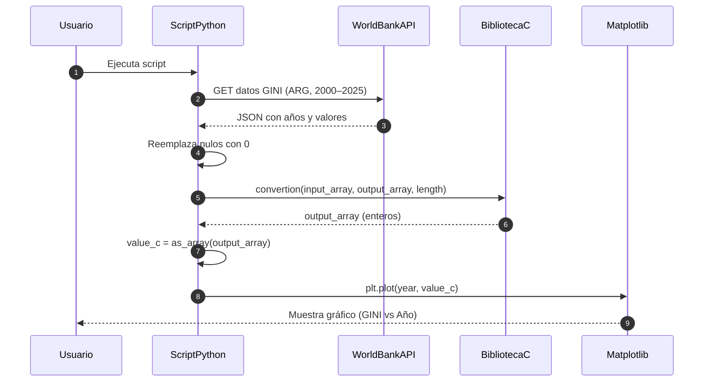
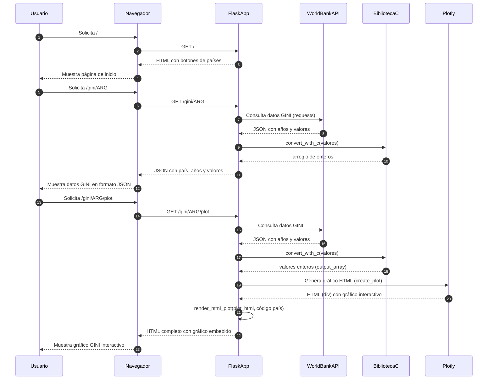
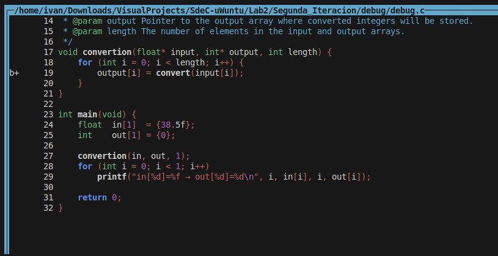
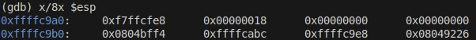
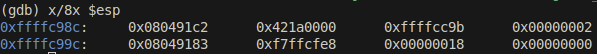
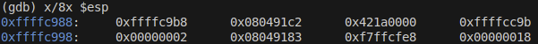
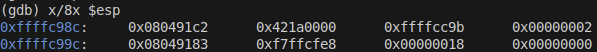

<h1 align="center">📘 Universidad Nacional de Córdoba</h1>

<p align="center">
  
</p>

---

<h3 align="center">💻 SISTEMAS DE COMPUTACIÓN</h3>
<h4 align="center">Trabajo Práctico N°2: <em>Calculadora de Índices GINI</em></h4>
<h4 align="center">Grupo: <strong>uWuntu</strong> 🚀</h4>

---

## Introducción

En los sistemas compuestos por hardware y software, se utilizan arquitecturas de capas para desarrollar aplicaciones complejas. En las capas superiores se trabaja se suelen implementar con lenguajes de más alto nivel más amigables para realizar interfaces de usuario UI. En la capa más inferior, se suele colocar procesos más performantes y a su vez más cercanos con el hardware.
En este trabajo se aplicará esta arquitectura de capas colocando varios lenguajes de diferentes niveles para lograr aplicar este concepto, donde utilizaremos Python para realizar una interfaz y aplicar las consultas a la API de 'WorldBank' acerca de los Índices GINI, luego en el lenguaje 'C' se aplicaran dos iteraciones o pasos para este trabajo.

* Primera Iteración: Se utilizará el lenguaje 'C' para procesar estos datos provenientes de la API de una manera más performante de lo que haría Python y demostrando una segunda capa inferior.
  
* Segunda Iteración: Luego de aplicar esta capa en 'C', el procesado matemático de estos datos se lo hará en Netwide Assembler o 'NASM', de manera que se pueda demostrar una capa más cercana al hardware y mucho más performante (Generalmente esto se aplica en proceso de datos que requieren un tiempo mínimo y específico), la idea de este trabajo es demostrar esa posibilidad de integrar varios lenguajes para formar una aplicación.
  
Recordemos que los lenguajes de bajo nivel están entre uno de los primeros intentos de la humanidad de despegar de la programación directa en lenguaje de máquina. Así el "ensamblador" es un lenguaje propio de la arquitectura y un intento de construir un lenguaje más accesible con el programador.
Los lenguajes de alto nivel, para controlar el hardware y su interacción con los sistemas físicos que lo rodean, necesitan acceder al hardware a través de los lenguajes de bajo nivel. Para ello utilizan convenciones de llamadas.
Entender cómo funciona una convención de llamada nos acercará a un conocimiento de sumo interés para áreas de desarrollo de sistemas críticos, seguridad y también para profundizar sobre el conocimiento de la interacción entre software y hardware.

Este trabajo práctico aplica dicha arquitectura, combinando lenguajes de diferentes niveles para demostrar cómo se integran en una solución funcional:

- **Python** Será utilizado para implementar la interfaz y obtener los índices GINI desde la API de WorldBank.
- **C** Procesará los datos de manera más eficiente, funcionando como una capa intermedia.
- **NASM** (Netwide Assembler) Realizará el cálculo matemático final, demostrando el uso de una capa de bajo nivel altamente performante.

El objetivo es evidenciar cómo cada lenguaje cumple un rol dentro de una estructura organizada, y cómo se comunican mediante convenciones de llamada.

<p align="center">
  
</p>

---

## Desarrollo

### Primera Iteración

En esta primera iteración del trabajo, se tomarán datos de la API acerca del índice GINI en Argentina a lo largo de los años, donde estos datos son entregados en formato 'JSON' tomando mediante un lenguaje de alto nivel (python), luego este llamará a una función definida en un lenguaje de menor nivel, en este caso 'C', la cual hará la conversión de los datos flotantes a tipo entero y luego se le sumará 1(uno).

- Conversión de valores flotantes a enteros 
- Suma de 1 a cada valor como validación del procesamiento 

Para esto, se utiliza `ctypes` para cargar dinámicamente una librería compartida (`main.so`) y definir el tipo de parámetros esperados. Proveniente de la compilación del código escrito y tal como sería implementar una librería de funciones. Al principio, nos resultó particularmente raro esto debido a que como parámetros de nuestra función en 'C', se reciben punteros a arreglos de valores de punto flotante, lo cual el python, como es un lenguaje de bajo tipado, lo primero que se nos viene a la cabeza es la forma de pasar estos parámetros. Para ello se utiliza también esta librería que permite especificar cada parámetro y valor de retorno de nuestra función.

```python
def convertion(input, output, length):
    main_c.convertion(input, output, length)

lib_path = os.path.join(os.path.dirname(__file__), 'main.so')
main_c = ctypes.CDLL(lib_path)

main_c.convertion.argtypes = (
    ctypes.POINTER(ctypes.c_float),  
    ctypes.POINTER(ctypes.c_int),   
    ctypes.c_int                    
)
main_c.convertion.restype = ctypes.c_void_p

```

#### Diagrama de Secuencia del Script GINI (requests + C + matplotlib)


---

### Segunda Iteración

En esta segunda iteración, se agregará una capa aún más inferior delegando la tarea de cálculo a 'NASM' aplicando además la convención de llamadas.
Además se migrará la interfaz de usuario (UI) a una página web local corrida mediante Flask en Python, donde mediante una petición GET es posible obtener el gráfico (Con los datos ya calculados y pasando por las capas inferiores) para cada país mediante un código deniminado 'Country_Code' Código ISO 3166-1 alpha-3.

Aquí podemos visualizar la forma en la cual se consultan los datos de la API y se los prepara para enviarlos a C.

```python
def get_data(country_code:str) -> tuple:
    """
    Consulta datos del índice GINI para un país específico.

    Args:
        country_code (str): Código ISO del país (ej: 'ARG', 'BR', etc.)

    Returns:
        Tuple[np.ndarray, np.ndarray]: años y valores GINI
    """
    url = f"https://api.worldbank.org/v2/en/country/{country_code}/indicator/SI.POV.GINI"
    params = {"format": "json", "date": "2000:2025"}

    response = requests.get(url, params=params)
    
    if response.ok:
        try:
            data = response.json()
            results = data[1]

            year = []
            value = []
            for entry in results:
                year.append(entry['date'])
                value.append(entry['value'] if entry['value'] is not None else 0)

            year = np.flip(np.array(year, dtype=float))
            value = np.flip(np.array(value, dtype=float))
            return year, value
        except Exception as e:
            print("Error parsing data:", e)
            return None, None
    else:
        return None, None
```

---

#### Diagrama de Secuencia Completo de la App GINI



Mediante esto, podemos correr en un servidor local una página que nos permite acceder de forma dinámica a los gráficos del índice, pasando por toda la arquitectura de capas para aplicar el procesamiento de los datos.

<p align="center">
  
</p>

<p align="center">
  
</p>

---

## Análisis del movimiento del stack antes, después y durante la llamada a `convert` con GDB

### 1. Antes de llamar a `convert`

**Breakpoint en `convertion`**



- Estamos dentro de `main()`, en la función `convertion()`.
- Todavía no se llamó a la función `convert`.
- El stack contiene:
  - La dirección de retorno hacia `main`.
  - Variables locales de `main`.
  - Parámetros pasados a `convertion`: `input`, `output`, `length`.

**Stack en este punto:**




### 2. Durante la ejecución dentro de `convert`, previo a ejecutar `push ebp`

Una vez que la función `convert` comienza su ejecución, el stack se organiza siguiendo la convención `cdecl`, respetando el nuevo marco (`stack frame`).

**Stack luego de hacer el llamado a la función `convert`:**



#### Análisis:

En este momento:

- La función `convert(float value)` recién acaba de ser llamada.
- El `CALL` a `convert` ya sucedió, por lo tanto en el stack ya está:
  - La dirección de retorno a `convertion` (para cuando `convert` termine).
  - El parámetro pasado a `convert` (el `float value`).

#### Relación con la convención de llamadas (`cdecl`):

- **Parámetros**: Se pasan en la pila, de derecha a izquierda (en este caso, un único `float`).
- **Dirección de retorno**: Se guarda automáticamente por la instrucción `CALL`.
- Todavía no se ha creado el nuevo marco de pila (`frame`) de `convert`. Eso sucede justo en el siguiente paso (`push ebp` y `mov ebp, esp`).

#### Stack antes del `push ebp`

| Dirección | Contenido                  | Descripción                        |
|:----------|:----------------------------|:-----------------------------------|
| [esp]     | Dirección de retorno         | A `convertion` (después del `call`) |
| [esp+4]   | Argumento `float` (`38.5f`)   | El valor pasado a `convert`         |

### 3. Luego de ejecutar `push ebp`

**Stack luego de hacer `push ebp` dentro de `convert`**



#### Análisis:

En este momento:

- Se acaba de ejecutar `push ebp`, como primer instrucción de la función `convert`.
- Esto es parte de la creación del nuevo frame de pila estándar en C (`cdecl`).

#### Relación con la convención de llamadas (`cdecl`):

- **push ebp**: Guarda el valor anterior de `ebp` para poder restaurarlo al salir de la función.

#### ¿Qué queda en el stack?

| Dirección | Contenido                  | Descripción                       |
|:----------|:----------------------------|:----------------------------------|
| [esp]     | Valor anterior de `ebp`      | Marco de pila anterior guardado.  |
| [esp+4]   | Dirección de retorno         | A `convertion`                    |
| [esp+8]   | Argumento `float` (`38.5f`)   | El valor a convertir en `convert` |


### 4. Ejecución de instrucciones que no afectan al stack

- `mov ebp, esp` crea el nuevo stack frame.
- El argumento se accede mediante la posición relativa `[ebp+8]`.
- Variables locales temporales se manejan en espacio reservado `[ebp-4]`.
- `eax` se utiliza como registro de retorno, como dicta la convención estándar de llamadas en x86 (`cdecl`).
- `mov esp, ebp` destruye el marco de pila.

### 5. Ejecución de `pop ebp` 

Después de terminar el cuerpo de la función `convert`, se ejecuta `pop ebp`.

#### ¿Qué hace `pop ebp`?

- Toma el valor en lo más alto del stack (`esp`) y lo carga en `ebp`.
- Este valor es el antiguo `ebp` de la función `convertion`.
- Se restablece el stack frame original antes de entrar en `convert`.

**Stack después de `pop ebp`:**

| Dirección | Contenido                | Descripción                        |
|:----------|:--------------------------|:-----------------------------------|
| [esp]     | Dirección de retorno       | Dirección donde continuar (`convertion`).
| [esp+4]   | Argumento `float` (38.5f)   | El valor original pasado a `convert`.

**Estado del stack:**




### 6. Ejecución de `ret` (retornar a `convertion`)

Luego de restaurar `ebp`, se ejecuta la instrucción `ret`.

#### ¿Qué hace `ret`?

- Extrae el valor que hay en `[esp]` (la dirección de retorno).
- Salta a esa dirección (vuelve a `convertion`, justo después del `call convert`).
- Incrementa automáticamente `esp` para limpiar el stack.

#### **Después de `ret`:**
- El stack queda igual que estaba antes de hacer `call convert`.
- Se elimina la dirección de retorno del stack.
- Se sigue ejecutando `convertion` normalmente.

**Estado del stack:**


---

## Conclusión

Este trabajo demuestra cómo una arquitectura de capas puede facilitar el desarrollo de soluciones robustas y eficientes. Utilizar diferentes lenguajes según su nivel de abstracción permite optimizar el rendimiento, la claridad del código y su mantenimiento.

Integrar Python, C y NASM no solo permitió mejorar el desempeño de las operaciones matemáticas, sino también adquirir un entendimiento más profundo de la interacción entre software de alto nivel y el hardware subyacente.

## Bibliografía

* [Paul A. Carter - PCASM](http://pacman128.github.io/pcasm/)
* [Documentación API WorldBank](https://documents.worldbank.org/en/publication/documents-reports/api)
* [Flask - RealPython](https://realpython.com/api-integration-in-python/)

