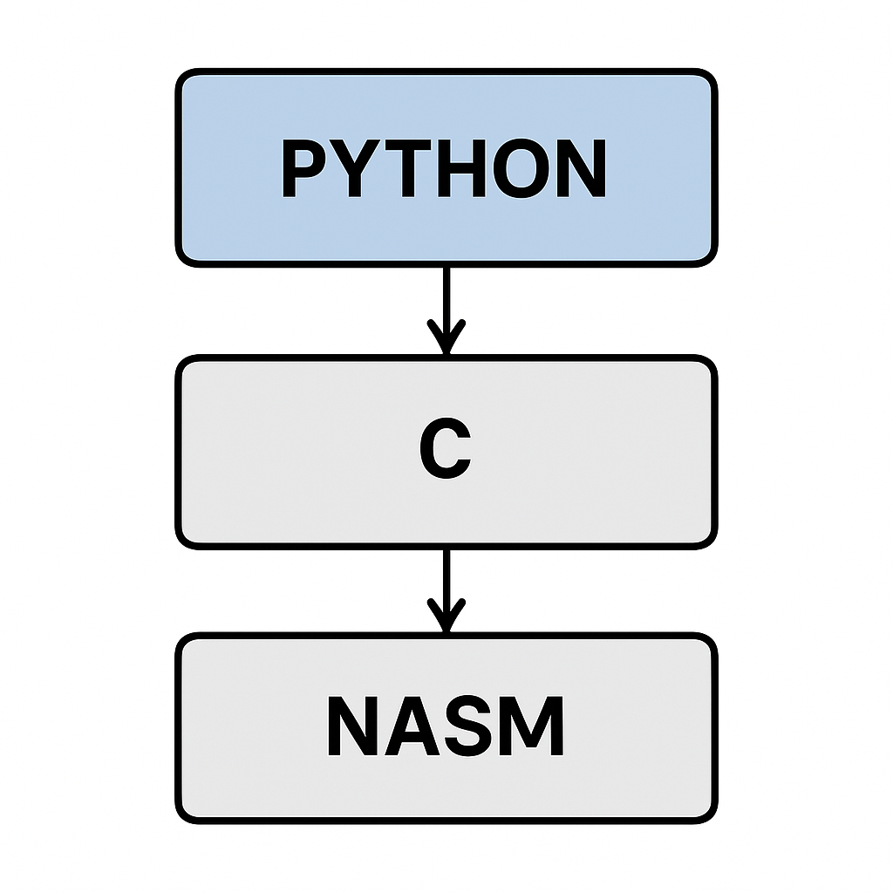
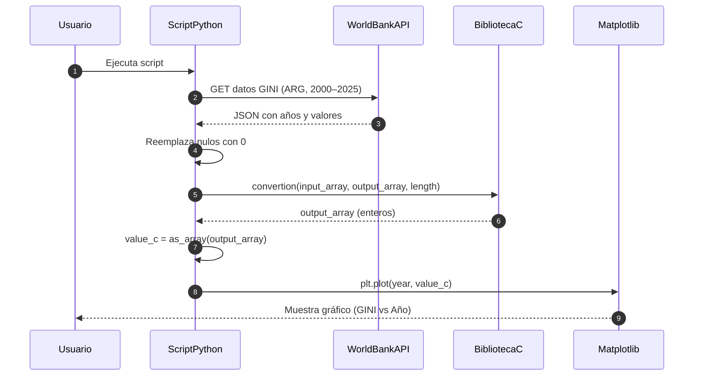
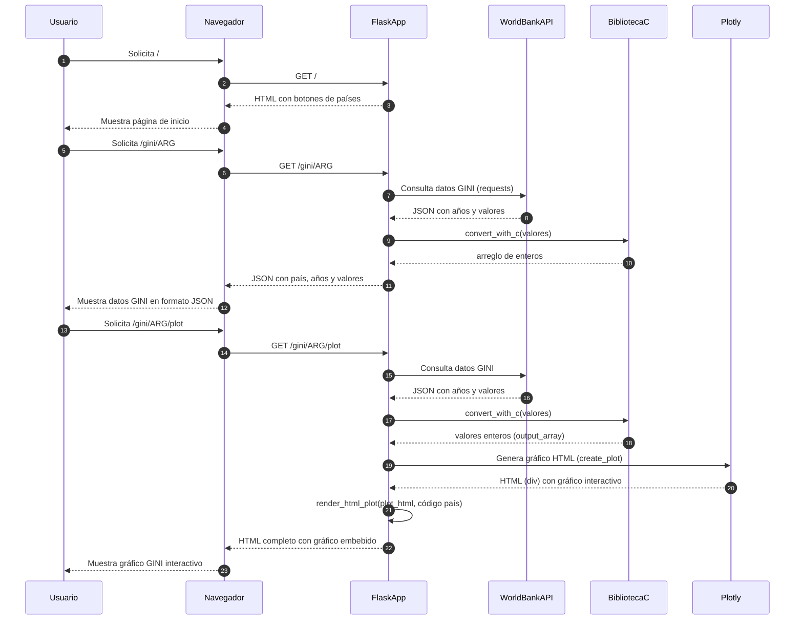
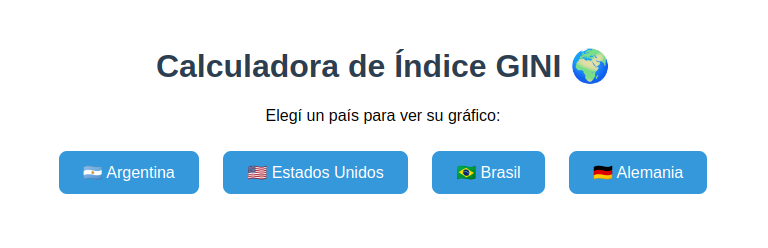
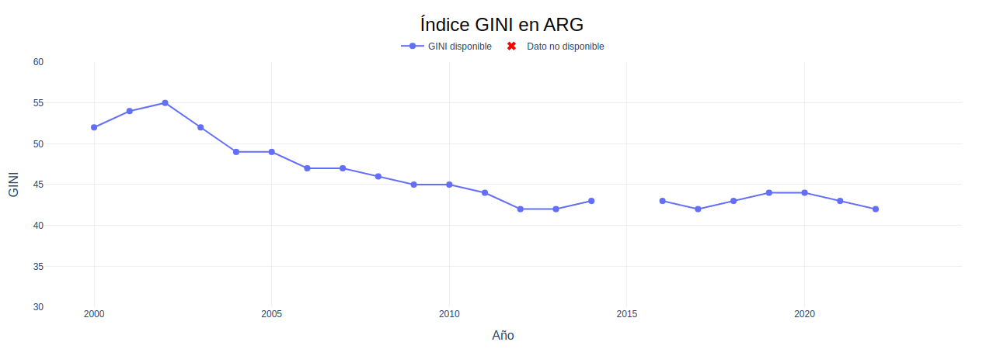

<h1 align="center">📘 Universidad Nacional de Córdoba</h1>

<p align="center">
  
</p>

---

<h3 align="center">💻 SISTEMAS DE COMPUTACIÓN</h3>
<h4 align="center">Trabajo Práctico N°2: <em>Calculadora de Índices GINI</em></h4>
<h4 align="center">Grupo: <strong>uWuntu</strong> 🚀</h4>

---

## 📌 Introducción

En los sistemas compuestos por hardware y software, se utilizan arquitecturas de capas para desarrollar aplicaciones complejas. En las capas superiores se trabaja se suelen implementar con lenguajes de más alto nivel más amigables para realizar interfaces de usuario UI. En la capa más inferior, se suele colocar procesos más performantes y a su vez más cercanos con el hardware.
En este trabajo se aplicará esta arquitectura de capas colocando varios lenguajes de diferentes niveles para lograr aplicar este concepto, donde utilizaremos Python para realizar una interfaz y aplicar las consultas a la API de 'WorldBank' acerca de los Índices GINI, luego en el lenguaje 'C' se aplicaran dos iteraciones o pasos para este trabajo.

* Primera Iteración: Se utilizará el lenguaje 'C' para procesar estos datos provenientes de la API de una manera más performante de lo que haría Python y demostrando una segunda capa inferior.
  
* Segunda Iteración: Luego de aplicar esta capa en 'C', el procesado matemático de estos datos se lo hará en Netwide Assembler o 'NASM', de maner que se pueda demostrar una capa más cercana al hardware y mucho más performante (Generalmente esto se aplica en proceso de datos que requieren un tiempo mínimo y específico), la idea de este trabajo es demostrar esa posibilidad de integrar varios lenguajes para formar una aplicación.
  
Recordemos que los lenguajes de bajo nivel están entre uno de los primeros intentos de la humanidad de despegar de la programación directa en lenguaje de máquina. Así el "ensamblador" es un lenguaje propio de la arquitectura y un intento de construir un lenguaje más accesible con el programador.
Los lenguajes de alto nivel, para controlar el hardware y su interacción con los sistemas físicos que lo rodean, necesitan acceder al hardware a través de los lenguajes de bajo nivel. Para ello utilizan convenciones de llamadas.
Entender cómo funciona una convención de llamada nos acercará a un conocimiento de sumo interés para áreas de desarrollo de sistemas críticos, seguridad y también para profundizar sobre el conocimiento de la interacción entre software y hardware.

Este trabajo práctico aplica dicha arquitectura, combinando lenguajes de diferentes niveles para demostrar cómo se integran en una solución funcional:

- 🐍 **Python** Será utilizado para implementar la interfaz y obtener los índices GINI desde la API de WorldBank.
- 💡 **C** Procesará los datos de manera más eficiente, funcionando como una capa intermedia.
- 🛠️ **NASM** (Netwide Assembler) Realizará el cálculo matemático final, demostrando el uso de una capa de bajo nivel altamente performante.

El objetivo es evidenciar cómo cada lenguaje cumple un rol dentro de una estructura organizada, y cómo se comunican mediante convenciones de llamada.

<p align="center">
  
</p>


## ⚙️ Desarrollo

### 🔁 Primera Iteración

En esta primera iteración del trabajo, se tomarán datos de la API acerca del índice GINI en Argentina a lo largo de los años, donde estos datos son entregados en formato 'JSON' tomando mediante un lenguaje de alto nivel (python), luego este llamará a una función definida en un lenguaje de menor nivel, en este caso 'C', la cual hará la conversión de los datos flotantes a tipo entero y luego se le sumará 1(uno).

- Conversión de valores flotantes a enteros 🔢
- Suma de 1 a cada valor como validación del procesamiento ➕

Para esto, se utiliza `ctypes` para cargar dinámicamente una librería compartida (`main.so`) y definir el tipo de parámetros esperados. Proveniente de la compilación del código escrito y tal como sería implementar una librería de funciones. Al principio, nos resultó particularmente raro esto debido a que como parámetros de nuestra función en 'C', se reciben punteros a arreglos de valores de punto flotante, lo cual el python, como es un lenguaje de bajo tipado, lo primero que se nos viene a la cabeza es la forma de pasar estos parámetros. Para ello se utiliza también esta librería que permite especificar cada parámetro y valor de retorno de nuestra función.

```python
def convertion(input, output, length):
    main_c.convertion(input, output, length)

# Load the shared C library
lib_path = os.path.join(os.path.dirname(__file__), 'main.so')
main_c = ctypes.CDLL(lib_path)

# Define argument and return types for the C function
main_c.convertion.argtypes = (
    ctypes.POINTER(ctypes.c_float),  # float* input
    ctypes.POINTER(ctypes.c_int),    # int* output
    ctypes.c_int                     # int length
)
main_c.convertion.restype = ctypes.c_void_p

```

#### Diagrama de Secuencia del Script GINI (requests + C + matplotlib)



...

### 🧮 Segunda Iteración

En esta segunda iteración, se agregará una capa aún más inferior delegando la tarea de cálculo a 'NASM' aplicando además la convención de llamadas.
Además se migrará la interfaz de usuario (UI) a una página web local corrida mediante Flask en Python, donde mediante una petición GET es posible obtener el gráfico (Con los datos ya calculados y pasando por las capas inferiores) para cada país mediante un código deniminado 'Country_Code' Código ISO 3166-1 alpha-3.

#### Diagrama de Secuencia Completo de la App GINI



Mediante esto, podemos correr en un servidor local una página que nos permite acceder de forma dinámica a los gráficos del índice, pasando por toda la arquitectura de capas para aplicar el procesamiento de los datos.

<p align="center">
  
</p>

<p align="center">
  
</p>


#### Análisis con GDB
Aquí podemos visualizar el estado del área de memoria que contiene el stack antes y después de la llamada a la función de assembler.

...

## ✅ Conclusión

Este trabajo demuestra cómo una arquitectura de capas puede facilitar el desarrollo de soluciones robustas y eficientes. Utilizar diferentes lenguajes según su nivel de abstracción permite optimizar el rendimiento, la claridad del código y su mantenimiento 🧠.

Integrar Python, C y NASM no solo permitió mejorar el desempeño de las operaciones matemáticas, sino también adquirir un entendimiento más profundo de la interacción entre software de alto nivel y el hardware subyacente.

## 📚 Bibliografía

* [📖 Paul A. Carter - PCASM](http://pacman128.github.io/pcasm/)
* [📄 Documentación API WorldBank](https://documents.worldbank.org/en/publication/documents-reports/api)
* [🐍 Flask - RealPython](https://realpython.com/api-integration-in-python/)

