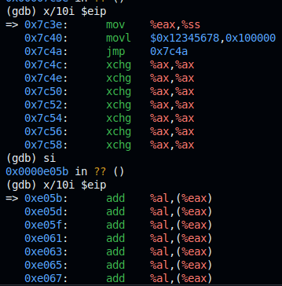

### Linker


En esta parte del trabajo utilizaremos un pequeño programa escrito en lenguaje ensamblador, junto con un linker script, para ejemplificar la carga y ejecución de un sistema en modo real.
Partiremos de un código simple que imprime un mensaje en pantalla utilizando servicios del BIOS en modo real. Para asegurar que el programa sea cargado correctamente por el BIOS, se empleará un linker script que define explícitamente la dirección de carga y estructura la imagen final adecuada para el arranque.

---

## Linker Script utilizado

El siguiente linker script (`link.ld`) especifica cómo deben ubicarse las secciones del programa:

```
SECTIONS
{
    . = 0x7c00;
    .text :
    {
        __start = .;
        *(.text)
        . = 0x1FE;
        SHORT(0xAA55)
    }
}
```

### Explicación

#### Dirección de Carga 0x7C00

El script indica que el programa debe colocarse en la dirección `0x7C00`. Esta es dirección la ubicación estándar donde el BIOS (Basic Input/Output System) carga el primer sector (512 bytes) de un dispositivo de arranque.

#### Sección `.text`

Se define una sección `.text` donde se ubicarán todas las instrucciones del programa ensamblado.  
La directiva `__start = .;` marca el inicio de esta sección, permitiendo referencias al comienzo del código si fuera necesario.

#### Firma de Arranque 0xAA55

Dentro de la sección `.text`, se avanza la ubicación actual hasta `0x1FE` (510 bytes desde `0x7C00`). Esto corresponde a los últimos dos bytes del sector de 512 bytes.

En esta ubicación (`0x7C00 + 0x1FE = 0x7DFE` en RAM), se escribe el valor `0xAA55` utilizando `SHORT(0xAA55)`.  
Esta secuencia es conocida como boot signature o magic number.

El BIOS requiere esta firma específica en esta posición exacta para validar que el sector es un sector de arranque válido.  
Si la firma no está presente o está en otra posición, el BIOS generalmente no intentará ejecutar el código del sector, resultando en un fallo de arranque.

### Código en Assembly 

El programa en ensamblador (`main.s`) realiza una operación sencilla: imprimir en pantalla el mensaje `"hello world"` utilizando funciones del BIOS en modo real de 16 bits.


```
.code16
    mov $msg, %si
    mov $0x0e, %ah
loop:
    lodsb
    or %al, %al
    jz halt
    int $0x10
    jmp loop
halt:
    hlt
msg:
    .asciz "hello world"
```

## Comandos utilizados para la construcción y ejecución

Para ensamblar, enlazar y ejecutar el programa, se utilizan tres comandos fundamentales:

### 1. Ensamblado: `as -g -o main.o main.s`

Este comando invoca el assembler de GNU (`as`) para convertir el código fuente en ensamblador (`main.s`) en un archivo objeto (`main.o`).

- `-g` agrega información de depuración.
- `-o main.o` define el nombre del archivo de salida.
- `main.s` es el archivo de entrada que contiene el programa en lenguaje ensamblador.

Se genera un archivo objeto que contiene el código en formato intermedio, aún no ejecutable.


### 2. Enlace: `ld --oformat binary -o main.img -T link.ld main.o`

Este comando utiliza el linker de GNU (`ld`) para transformar el archivo objeto en una imagen binaria lista para ser cargada directamente en memoria por el BIOS.

- `--oformat binary` indica que se desea generar un archivo binario plano, sin cabeceras ni metadatos adicionales.
- `-o main.img` especifica el nombre de la imagen de salida.
- `-T link.ld` indica el uso de un linker script personalizado (`link.ld`), que define la organización de la imagen y la dirección de carga (`0x7C00`).
- `main.o` es el archivo objeto previamente generado.

Se obtiene `main.img`. Un archivo binario plano que contiene el programa y la firma de booteo (`0xAA55`), apto para ser reconocido por el BIOS como un sector de arranque válido.


### 3. Ejecución: `qemu-system-x86_64 -drive format=raw,file=main.img`

Finalmente, este comando inicia una máquina virtual utilizando QEMU, emulando una computadora x86 de 64 bits, y le indica que utilice la imagen generada como disco de arranque.

- `-drive format=raw,file=main.img` especifica de manera explícita que la imagen es de tipo RAW (binario plano) y proporciona la ruta del archivo.

El sistema emulado carga la imagen en memoria, ejecuta el programa en modo real y muestra el mensaje `"hello world"` utilizando servicios del BIOS.

Perfecto, ya vi lo que subiste. Vamos a seguir tu orden:

Primero, respondamos las preguntas del desafío final que marcaba el PDF:

---

## 🛡️ Desafío Final: Modo Protegido

### 1. ¿Cómo sería un programa que tenga dos descriptores de memoria diferentes, uno para cada segmento (código y datos) en espacios de memoria diferenciados?

Un programa de este tipo debería:

- **Definir una GDT (Global Descriptor Table)** con al menos **tres descriptores**:
  1. Descriptor **nulo** (obligatorio).
  2. Descriptor de **código**: ejecución y lectura (`Access byte = 0x9A`).
  3. Descriptor de **datos**: lectura y escritura (`Access byte = 0x92`) o solo lectura (`Access byte = 0x90`).

- **Ubicar** el código y los datos en **regiones distintas de memoria**.
  - Por ejemplo:
    - Código en `0x00000000`.
    - Datos en `0x00100000`.

- **Secuencia del programa**:
  - Arranca en modo real (`.code16`).
  - Desactiva interrupciones (`cli`).
  - Carga la GDT (`lgdt`).
  - Activa el modo protegido (`movl %cr0, %eax; orl $0x1, %eax; movl %eax, %cr0`).
  - Salta al modo protegido (`ljmp`).
  - En modo protegido (`.code32`): configura los registros de segmento y ejecuta operaciones.

#### 🖊️ de código en GAS

```assembly
.code16
.global _start
_start:
    cli
    lgdt gdt_descriptor

    movl %cr0, %eax
    orl $0x1, %eax
    movl %eax, %cr0

    ljmp $0x08, $protected_mode

.align 8
gdt_start:
    .quad 0x0000000000000000  # Descriptor nulo

    # Descriptor de Código (0x08)
    .word 0xFFFF
    .word 0x0000
    .byte 0x00
    .byte 0x9A
    .byte 0xCF
    .byte 0x00

    # Descriptor de Datos (0x10)
    .word 0xFFFF
    .word 0x0000
    .byte 0x10   # Base media si quisiéramos separarlo en 0x00100000
    .byte 0x92   # Lectura/escritura (o 0x90 para solo lectura)
    .byte 0xCF
    .byte 0x00
gdt_end:

gdt_descriptor:
    .word gdt_end - gdt_start - 1
    .long gdt_start

.code32
protected_mode:
    movw $0x10, %ax
    movw %ax, %ds
    movw %ax, %es
    movw %ax, %ss

    # operaciones
```

### 2. Cambiar los bits de acceso del segmento de datos para que sea solo lectura, intentar escribir. ¿Qué sucede? ¿Qué debería suceder? Verificarlo con GDB.

Si el **segmento de datos** se configura como **solo lectura** (`Access byte = 0x90`) y se intenta escribir en él, ocurre:

- ❌ El procesador detecta una **violación de protección**.
- ⚡ Dispara una **excepción General Protection Fault** (**#GP**).
- 🔖 Busca en la **IDT** (Interrupt Descriptor Table) el handler para el #GP.
- ⚠️ Como **no hay IDT** cargada, el procesador **salta a una dirección aleatoria**.
- ❌ Comienza a interpretar basura como código (ej. `add %al, (%eax)`).



#### 🧠 Conclusión importante

> **El procesador detecta la excepción, pero como no existe un handler definido para manejarla (no hay IDT cargada), el flujo de ejecución se rompe: el EIP salta a direcciones aleatorias de memoria, ejecutando basura. Esto simula un fallo de seguridad real que, en sistemas operativos, podría ser explotado para ejecutar código no autorizado o provocar caídas críticas.**

#### 🔧 Verificación con GDB

1. Compilamos y corremos con:
   ```bash
   make debug_segundo
   ```

2. GDB se conecta a QEMU y pone un breakpoint en `0x7C00`.

3. Continuamos la ejecución (`c` o `continue`).

4. En el momento de ejecutar:
   ```assembly
   movl $0x12345678, 0x00100000
   ```
   GDB muestra:
   - Cambio inesperado del `EIP`.
   - EIP saltando a direcciones como `0xE05B`.
   - Código basura ejecutándose (`add %al, (%eax)`).

5. Confirmamos que la excepción se generó pero no fue manejada.

### 3. En modo protegido, ¿Con qué valor se cargan los registros de segmento? ¿Por qué?

En modo protegido, los registros de segmento (`CS`, `DS`, `SS`, `ES`, `FS`, `GS`) **no almacenan direcciones** como en modo real.

**Se cargan con un *selector***:

- Un **selector** es un identificador especial que contiene:
  - Un índice a la GDT (o LDT).
  - Un bit de selector de tabla (TI).
  - Un nivel de privilegio (RPL).

Por ejemplo:
- `movw $0x10, %ax`
- `movw %ax, %ds`

`0x10` significa:
- Índice: `0x2` (porque 0x10 >> 3 = 2)
- Tabla: GDT (porque TI = 0)
- Privilegio: 0

> **En modo protegido, los registros de segmento actúan como "claves" para acceder a los descriptores de segmento en la GDT, que contienen la base real, el límite y los permisos del segmento. Esto permite al procesador implementar protecciones de memoria, multitarea segura, y aïslamiento de procesos.**

