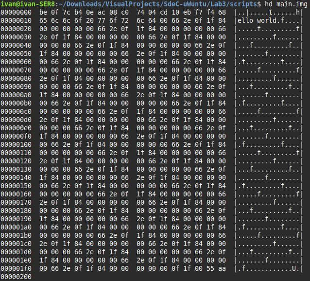
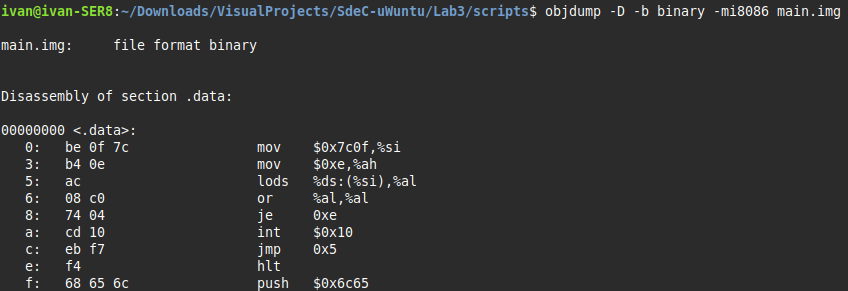
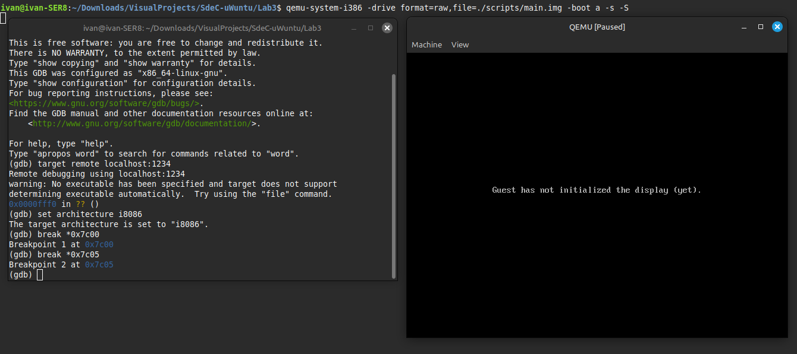
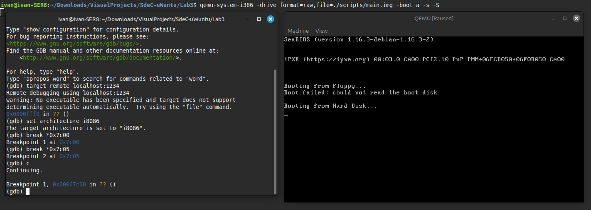
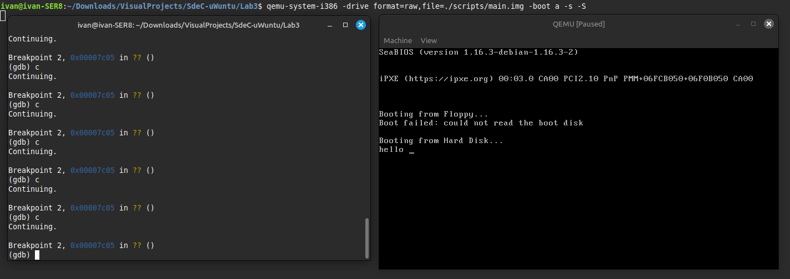

<h1 align="center">📘 Universidad Nacional de Córdoba</h1>

<p align="center">
  
</p>

---

<h3 align="center">💻 SISTEMAS DE COMPUTACIÓN</h3>
<h4 align="center">Trabajo Práctico N°3: <em>Modo Protegido</em></h4>
<h4 align="center">Grupo: <strong>uWuntu</strong> 🚀</h4>

---

## Introducción
En los sistemas operativos modernos, las arquitecturas de procesadores fueron evolucionando para ofrecer diferentes modos de operación, tal como **Modo Real** y **Modo Protegido**; El primero se trata de la primera forma en la que se operaban los procesadores x86, fué diseñado para ser simple y permitir una ejecución directa de las instrucciones, mientras que el segundo permitió aprovechar características avanzadas de protección y de multitarea.

| Característica              | Modo Real                   | Modo Protegido               |
|:----------------------------|:----------------------------|:-----------------------------|
| **Tipo de instrucciones**    | 16 bits                     | 32/64 bits                   |
| **Protección de memoria**    | No                          |                           Sí |
| **Multitarea**               | No                          | Sí                            |
| **Seguridad**                | Baja, sin aislamiento       | Alta, con aislamiento entre procesos |
| **Acceso a hardware**        | Acceso directo              | Acceso controlado y restringido |

El uso hoy en día del modo real se limita sólamente al proceso de arranque, donde los sistemas operativos arrancan en modo real para ejecutar las rutinas iniciales del BIOS o UEFI, incluyendo la verificación del hardware y la carga del bootloader.

## Desarrollo
### UEFI y Coreboot

**UEFI (Unified Extensible Firmware Interface)** es una interfaz moderna entre el firmware del hardware y el sistema operativo que reemplaza al antiguo BIOS (Basic Input Output System) que tradicionalmente es basado en texto con configuraciones ajustadas mediante teclas específicas (modo real, teclado), esto nos permite iniciar el hardware para luego arrancar el sistema operativo; Para utilizarlo, al encender la computadora, presionando una tecla como `F2`, `Del` o `Esc` donde accedemos a UEFI desde una interfaz operativa donde es posible configurar el hardware, el orden de booteo, y demás.

<p align="center">
  
</p>

| Aspecto | BIOS | UEFI |
|:---|:---|:---|
| **Origen** | Antiguo (1980s) | Moderno (2005+) |
| **Interfaz** | Texto | Gráfica y mouse |
| **Tamaño de disco soportado** | Hasta 2 TB | Más de 2 TB |
| **Velocidad de arranque** | Lento | Rápido |
| **Seguridad** | Básica | Secure Boot |
| **Arquitectura** | 16 bits | 32/64 bits |
| **Compatibilidad** | Alta con sistemas viejos | Mejor con sistemas nuevos |


Desde un sistema operativo se puede hacer llamadas a funciones UEFI, como:

| Función | Descripción|
|:---|:---|
| **GetTime()** | Lee la fecha y hora actual del sistema desde el reloj en tiempo real (RTC). |
| **SetTime()** | Cambia la fecha y hora del sistema. Solo puede hacerlo si el firmware lo permite (por seguridad). |
| **GetVariable()** | Recupera una variable almacenada en la memoria NVRAM (por ejemplo, configuraciones de booteo). |
| **SetVariable()** | Crea o actualiza una variable en la NVRAM. Sirve para guardar configuraciones persistentes. |
| **GetNextVariableName()** | Sirve para enumerar todas las variables NVRAM disponibles. |
| **ResetSystem()** | Reinicia o apaga el sistema de manera controlada desde el firmware. |
| ...| ... |


En UEFI existen varios bugs, un ejemplo famoso fue **Boothole** (2020), una vulnerabilidad en GRUB2 que afectaba sistemas UEFI Secure Boot, permitiendo a atacantes ejecutar código malicioso antes del arranque del sistema operativo, otros bugs se dan por mal manejo de variables NVRAM o drivers UEFI inseguros.

- **CSME (Converged Security and Management Engine)** es una parte del hardware de Intel que maneja la seguridad y gestión del sistema de forma independiente al CPU principal. Corre en un microprocesador embebido.
- **MEBx (Intel Management Engine BIOS Extension)** es la interfaz de configuración de esa tecnología. Permite configurar redes, contraseñas, y otras funciones de administración remota.

**Coreboot** es un proyecto de firmware de código abierto que reemplaza el BIOS propietario tradicional. Su objetivo principal es inicializar el hardware de la forma más rápida y sencilla posible, para luego arrancar un sistema operativo o un cargador de arranque.

Se caracteriza por:
- Realizar solo las tareas estrictamente necesarias para cargar un sistema operativo.
- Ser modular, rápido y confiable.

Lo utilizan las **Chromebooks**, **System76**, **Purism Librem**, **PC Engines APU**, **Raptor Computing Systems**, entre otros

| Ventaja | Descripción |
|:---|:---|
| **Arranque más rápido** | Inicializa el hardware de manera eficiente, reduciendo el tiempo de booteo. |
| **Código abierto y auditable** | Cualquiera puede inspeccionar, modificar y mejorar el código fuente. |
| **Mayor control sobre el hardware** | Permite personalizar exactamente qué componentes se inicializan. |
| **Mayor seguridad** | Evita firmware propietario cerrado que podría contener vulnerabilidades ocultas. |
| **Flexibilidad** | Puede trabajar con payloads como SeaBIOS, Tianocore, LinuxBoot o directamente con un kernel Linux. |
| **Menor tamaño** | El firmware generado es mucho más pequeño que un BIOS tradicional. |

Es posible crear nuestra propia imágen booteable simplemente respetando la estructura clásica genérica del MBR, en la siguiente imágen se crea un archivo `.img` de manera que este produzca un `halt` en qemu (máquina virtual).

<p align="center">
  
</p>

---

# Linker
Un **linker** se trata de una herramienta que toma varios archivos de objetos generados por el compilador y los combina en un único ejecutable, es el encargado de resolver referencias a funciones y variables entre archivos.

La dirección que aparece en el script del linker, es la dirección de memoria donde el programa se cargará o ejecutará. Es necesaria para que el linker ubique correctamente el código, datos y secciones, y para que el sistema operativo (o el bootloader) sepa dónde colocarlo en RAM.

## Linker Script utilizado

El siguiente linker script (`link.ld`) especifica cómo deben ubicarse las secciones del programa:

```
SECTIONS
{
    . = 0x7c00;
    .text :
    {
        __start = .;
        *(.text)
        . = 0x1FE;
        SHORT(0xAA55)
    }
}
```

### Explicación

#### Dirección de Carga 0x7C00

El script indica que el programa debe colocarse en la dirección `0x7C00`. Esta es dirección la ubicación estándar donde el BIOS (Basic Input/Output System) carga el primer sector (512 bytes) de un dispositivo de arranque.

#### Sección `.text`

Se define una sección `.text` donde se ubicarán todas las instrucciones del programa ensamblado.  
La directiva `__start = .;` marca el inicio de esta sección, permitiendo referencias al comienzo del código si fuera necesario.

#### Firma de Arranque 0xAA55

Dentro de la sección `.text`, se avanza la ubicación actual hasta `0x1FE` (510 bytes desde `0x7C00`). Esto corresponde a los últimos dos bytes del sector de 512 bytes.

En esta ubicación (`0x7C00 + 0x1FE = 0x7DFE` en RAM), se escribe el valor `0xAA55` utilizando `SHORT(0xAA55)`.  
Esta secuencia es conocida como boot signature o magic number.

El BIOS requiere esta firma específica en esta posición exacta para validar que el sector es un sector de arranque válido.  
Si la firma no está presente o está en otra posición, el BIOS generalmente no intentará ejecutar el código del sector, resultando en un fallo de arranque.

### Código en Assembly 

El programa en ensamblador (`main.s`) realiza una operación sencilla: imprimir en pantalla el mensaje `"hello world"` utilizando funciones del BIOS en modo real de 16 bits.


```
.code16
    mov $msg, %si
    mov $0x0e, %ah
loop:
    lodsb
    or %al, %al
    jz halt
    int $0x10
    jmp loop
halt:
    hlt
msg:
    .asciz "hello world"
```

## Comandos utilizados para la construcción y ejecución

Para ensamblar, enlazar y ejecutar el programa, se utilizan tres comandos fundamentales:

### 1. Ensamblado: `as -g -o main.o main.s`

Este comando invoca el assembler de GNU (`as`) para convertir el código fuente en ensamblador (`main.s`) en un archivo objeto (`main.o`).

- `-g` agrega información de depuración.
- `-o main.o` define el nombre del archivo de salida.
- `main.s` es el archivo de entrada que contiene el programa en lenguaje ensamblador.

Se genera un archivo objeto que contiene el código en formato intermedio, aún no ejecutable.


### 2. Enlace: `ld --oformat binary -o main.img -T link.ld main.o`

Este comando utiliza el linker de GNU (`ld`) para transformar el archivo objeto en una imagen binaria lista para ser cargada directamente en memoria por el BIOS.

- `--oformat binary` indica que se desea generar un archivo binario plano, sin cabeceras ni metadatos adicionales.
- `-o main.img` especifica el nombre de la imagen de salida.
- `-T link.ld` indica el uso de un linker script personalizado (`link.ld`), que define la organización de la imagen y la dirección de carga (`0x7C00`).
- `main.o` es el archivo objeto previamente generado.

Se obtiene `main.img`. Un archivo binario plano que contiene el programa y la firma de booteo (`0xAA55`), apto para ser reconocido por el BIOS como un sector de arranque válido.


### 3. Ejecución: `qemu-system-x86_64 -drive format=raw,file=main.img`

Finalmente, este comando inicia una máquina virtual utilizando QEMU, emulando una computadora x86 de 64 bits, y le indica que utilice la imagen generada como disco de arranque.

- `-drive format=raw,file=main.img` especifica de manera explícita que la imagen es de tipo RAW (binario plano) y proporciona la ruta del archivo.

El sistema emulado carga la imagen en memoria, ejecuta el programa en modo real y muestra el mensaje `"hello world"` utilizando servicios del BIOS. Como se puede observar a continuación:

## Comparación entre `objdump` y `hd`

<p align="center">
  
</p>

<p align="center"><b>Fig 3. </b>Hexdump de main.img</p>


<p align="center">
  
</p>

<p align="center"><b>Fig 4. </b>Objdump de main.img</p>

## Comparación entre `objdump` y `hd`

<p align="center">
  
</p>

<p align="center"><b>Fig 3.</b> Hexdump de main.img</p>

<p align="center">
  
</p>

<p align="center"><b>Fig 4.</b> Objdump de main.img</p>

A continuación, se realiza la comparación entre el contenido hexadecimal visualizado con `hd` y el desensamblado de instrucciones obtenido con `objdump` sobre el archivo `main.img`.

### Análisis

En la Fig 3 (Hexdump), se observan los bytes crudos de la imagen binaria, donde los primeros valores corresponden a las instrucciones del programa.  
En la Fig 4 (Objdump), se interpreta ese contenido como instrucciones de la arquitectura i8086.

La correspondencia es la siguiente:

| Offset en `hd` | Bytes           | Instrucción `objdump`               |
|:---------------|:----------------|:------------------------------------|
| 0x00           | `be 0f 7c`       | `mov $0x7c0f, %si`                  |
| 0x03           | `b4 0e`          | `mov $0xe, %ah`                     |
| 0x05           | `ac`             | `lodsb`                             |
| 0x06           | `08 c0`          | `or %al, %al`                       |
| 0x08           | `74 04`          | `je 0xe`                            |
| 0x0A           | `cd 10`          | `int $0x10`                         |
| 0x0C           | `eb f7`          | `jmp 0x5`                           |

Cada instrucción mostrada por `objdump` se corresponde perfectamente con los bytes visibles en el `hexdump`.  
La secuencia es la esperada de acuerdo al programa ensamblador (`main.s`).

Además, se verifica que a partir del offset `0x0E` se encuentran los datos correspondientes al mensaje `"hello world"`, codificado en ASCII, y que en el offset `0x1FE` aparece la firma de arranque `55 aa`, requerida por el BIOS para considerar el sector como booteable.

### Relación entre offsets de `hd` y direcciones de memoria

El comando `hd` muestra los bytes del archivo binario `main.img` desde el offset `0x00`, ya que interpreta el archivo simplemente como una secuencia de datos lineales en disco.

Durante el proceso de arranque, el BIOS carga el contenido de `main.img` en la memoria RAM a partir de la dirección física `0x7C00`.  
Por lo tanto, el byte en el offset `0x00` de `hd` corresponde al byte ubicado en `0x7C00` en memoria una vez cargado.

## Debugging con GDB

Podemos depurar nuestro programa `main.img` utilizando **GDB** en conjunto con **QEMU**.  
Para ello, ejecutamos QEMU con las siguientes opciones que permiten conectar GDB al entorno de emulación:

- `-s` Activa un servidor GDB en el puerto `1234`.
- `-S` Inicia QEMU en pausa, esperando la conexión del depurador.
- `-monitor stdio` Permite interactuar con la consola de QEMU.

El comando completo sería:

```bash
qemu-system-i386 -drive format=raw,file=./scripts/main.img -boot a -s -S -monitor stdio
```

Una vez lanzado QEMU, abrimos una nueva terminal y ejecutamos `gdb`. Para enlazar GDB con QEMU se utiliza:

```bash
(gdb) target remote localhost:1234
```

Luego se configura GDB para modo real de 16 bits:

```bash
(gdb) set architecture i8086
```

### Configuración de Breakpoints

Se colocaron dos breakpoints:

- En `0x7C00`, correspondiente al inicio del bootloader.
- En `0x7C05`, justo antes de comenzar la impresión del mensaje `"hello world"`.

Comandos utilizados:

```bash
(gdb) break *0x7c00
(gdb) break *0x7c05
(gdb) continue
```

Cuando el BIOS carga el sector de arranque y salta a `0x7C00`, GDB detendrá la ejecución en el primer breakpoint.  
Luego, al continuar la ejecución, se alcanzará el segundo breakpoint en `0x7C05`, donde comienza la carga del primer carácter del mensaje en el registro `AL`.

A partir de ese punto, se puede ejecutar paso a paso (`stepi`) y observar cómo se carga e imprime cada carácter de la cadena `"hello world"` mediante la interrupción de BIOS `int 0x10`.

---

<p align="center">
  
</p>

<p align="center"><b>Fig 5.</b> QEMU detenido al arrancar, esperando conexión desde GDB.</p>

---

<p align="center">
  
</p>

<p align="center"><b>Fig 6.</b> Primer breakpoint alcanzado en 0x7C00, inicio del bootloader.</p>

---

<p align="center">
  
</p>

<p align="center"><b>Fig 7.</b> Segundo breakpoint alcanzado en 0x7C05, antes de comenzar la impresión del mensaje.</p>


---

# Modo Protegido

## Programa con dos descriptores de memoria (código y datos)
Se deben crear dos descriptores en la GDT:
- Uno para el segmento de código (solo lectura y ejecución).
- Uno para el segmento de datos (lectura/escritura).

## Cambiar bits de acceso del segmento de datos a solo lectura
Si se modifica el descriptor para que el segmento de datos sea solo lectura y luego se intenta escribir:
- Debería lanzarse una excepción de protección general (#GP).
- El sistema operativo o el manejador de excepciones debería actuar.

Esto puede verificarse en `gdb` generando la falla.

## ¿Con qué valor se cargan los registros de segmento en modo protegido? ¿Por qué?
Se cargan con el **selector** de la GDT correspondiente, no directamente con una dirección. El selector contiene el índice de entrada en la GDT y privilegios.

Esto es necesario porque en modo protegido no se trabaja directamente con direcciones físicas, sino con descriptores que definen propiedades del segmento (base, límite, permisos).


## Conclusión
