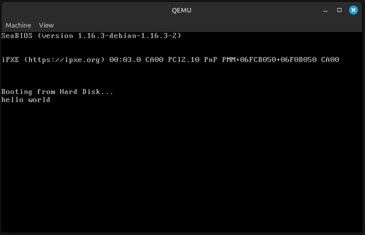

### Linker


En esta parte del trabajo utilizaremos un pequeño programa escrito en lenguaje ensamblador, junto con un linker script, para ejemplificar la carga y ejecución de un sistema en modo real.
Partiremos de un código simple que imprime un mensaje en pantalla utilizando servicios del BIOS en modo real. Para asegurar que el programa sea cargado correctamente por el BIOS, se empleará un linker script que define explícitamente la dirección de carga y estructura la imagen final adecuada para el arranque.

---

## Linker Script utilizado

El siguiente linker script (`link.ld`) especifica cómo deben ubicarse las secciones del programa:

```
SECTIONS
{
    . = 0x7c00;
    .text :
    {
        __start = .;
        *(.text)
        . = 0x1FE;
        SHORT(0xAA55)
    }
}
```

### Explicación

#### Dirección de Carga 0x7C00

El script indica que el programa debe colocarse en la dirección `0x7C00`. Esta es dirección la ubicación estándar donde el BIOS (Basic Input/Output System) carga el primer sector (512 bytes) de un dispositivo de arranque.

#### Sección `.text`

Se define una sección `.text` donde se ubicarán todas las instrucciones del programa ensamblado.  
La directiva `__start = .;` marca el inicio de esta sección, permitiendo referencias al comienzo del código si fuera necesario.

#### Firma de Arranque 0xAA55

Dentro de la sección `.text`, se avanza la ubicación actual hasta `0x1FE` (510 bytes desde `0x7C00`). Esto corresponde a los últimos dos bytes del sector de 512 bytes.

En esta ubicación (`0x7C00 + 0x1FE = 0x7DFE` en RAM), se escribe el valor `0xAA55` utilizando `SHORT(0xAA55)`.  
Esta secuencia es conocida como boot signature o magic number.

El BIOS requiere esta firma específica en esta posición exacta para validar que el sector es un sector de arranque válido.  
Si la firma no está presente o está en otra posición, el BIOS generalmente no intentará ejecutar el código del sector, resultando en un fallo de arranque.

### Código en Assembly 

El programa en ensamblador (`main.s`) realiza una operación sencilla: imprimir en pantalla el mensaje `"hello world"` utilizando funciones del BIOS en modo real de 16 bits.


```
.code16
    mov $msg, %si
    mov $0x0e, %ah
loop:
    lodsb
    or %al, %al
    jz halt
    int $0x10
    jmp loop
halt:
    hlt
msg:
    .asciz "hello world"
```

## Comandos utilizados para la construcción y ejecución

Para ensamblar, enlazar y ejecutar el programa, se utilizan tres comandos fundamentales:

### 1. Ensamblado: `as -g -o main.o main.s`

Este comando invoca el assembler de GNU (`as`) para convertir el código fuente en ensamblador (`main.s`) en un archivo objeto (`main.o`).

- `-g` agrega información de depuración.
- `-o main.o` define el nombre del archivo de salida.
- `main.s` es el archivo de entrada que contiene el programa en lenguaje ensamblador.

Se genera un archivo objeto que contiene el código en formato intermedio, aún no ejecutable.


### 2. Enlace: `ld --oformat binary -o main.img -T link.ld main.o`

Este comando utiliza el linker de GNU (`ld`) para transformar el archivo objeto en una imagen binaria lista para ser cargada directamente en memoria por el BIOS.

- `--oformat binary` indica que se desea generar un archivo binario plano, sin cabeceras ni metadatos adicionales.
- `-o main.img` especifica el nombre de la imagen de salida.
- `-T link.ld` indica el uso de un linker script personalizado (`link.ld`), que define la organización de la imagen y la dirección de carga (`0x7C00`).
- `main.o` es el archivo objeto previamente generado.

Se obtiene `main.img`. Un archivo binario plano que contiene el programa y la firma de booteo (`0xAA55`), apto para ser reconocido por el BIOS como un sector de arranque válido.


### 3. Ejecución: `qemu-system-x86_64 -drive format=raw,file=main.img`

Finalmente, este comando inicia una máquina virtual utilizando QEMU, emulando una computadora x86 de 64 bits, y le indica que utilice la imagen generada como disco de arranque.

- `-drive format=raw,file=main.img` especifica de manera explícita que la imagen es de tipo RAW (binario plano) y proporciona la ruta del archivo.

El sistema emulado carga la imagen en memoria, ejecuta el programa en modo real y muestra el mensaje `"hello world"` utilizando servicios del BIOS. Como se puede observar a continuación:


<p align="center">
  
</p>

<p align="center"><b>Fig 2. </b>Ejemplo Hello World</p>
