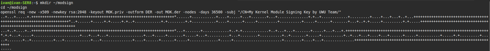
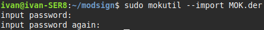
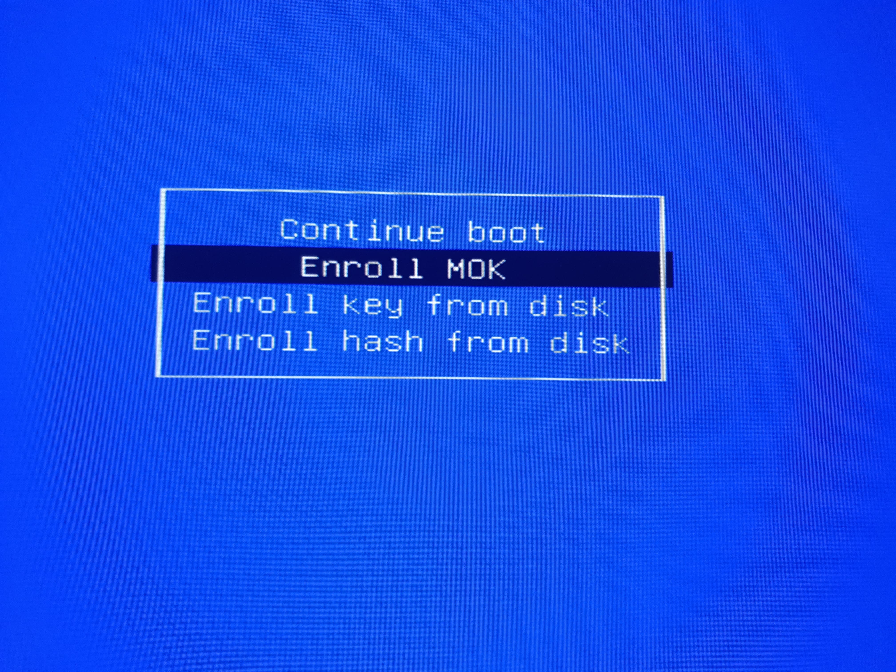
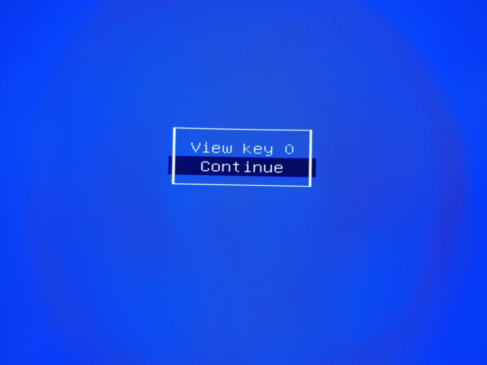
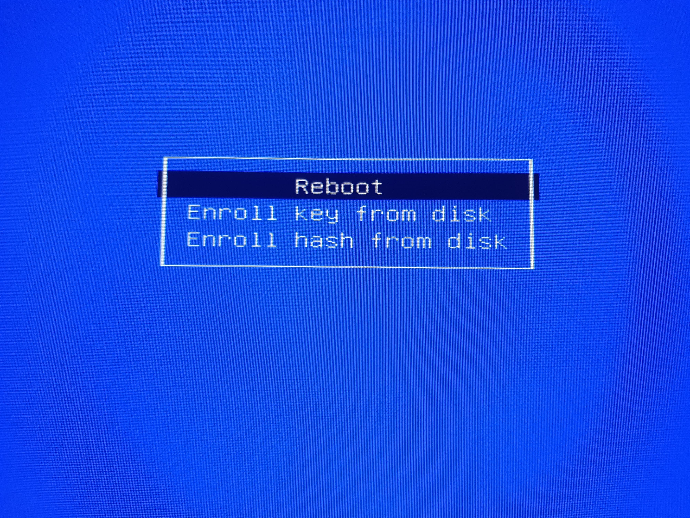
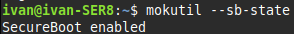
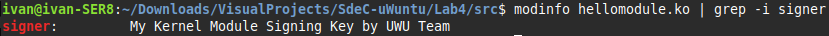
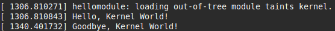
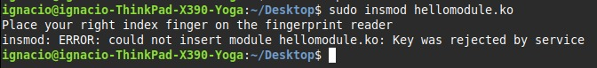

<h1 align="center">📘 Universidad Nacional de Córdoba</h1>

<p align="center">
  
</p>

---

<h3 align="center">💻 SISTEMAS DE COMPUTACIÓN</h3>
<h4 align="center">Trabajo Práctico N°4: <em>Módulos de Kernel & Llamadas a sistema</em></h4>
<h4 align="center">Grupo: <strong>uWuntu</strong> 🚀</h4>

---

# Introducción

Los módulos de kernel son fragmentos de código que permiten ampliar las funcionalidades del núcleo del sistema operativo sin necesidad de recompilar ni reiniciar todo el kernel. Esto es especialmente útil cuando se desea agregar nuevas funciones —como soporte para un dispositivo de hardware— sin modificar directamente el núcleo principal, que suele ser complejo y monolítico. 

Dado que estos módulos interactúan directamente con el núcleo, también representan la posibilidad de tener vulnerabilidades o pueden ser creados para usos maliciosos. Para mitigar estos riesgos, los sistemas implementan mecanismos de seguridad como la verificación mediante firmas digitales o claves, asegurando que solo módulos autorizados o firmados puedan ser cargados.

Las llamadas al sistema son la forma principal que los programas interactúan con el núcleo del sistema operativo, mediante esto, es posible que una aplicación soliicite servicios fundamentales como acceso a archivos, comunicación entre los procesos, adignación de memoria o el control de los dispositivos. Actúa como un puente seguro entre el espacio de usuario y el espacio del kernel, esto evita que los programas accedan directamente a los recursos del sistema operativo por razones de seguridad y estabilidad, cuando un proceso necesita realizar una operación privilegiada,  invoca una llamada al sistema específica, y el kernel se encarga de ejecutarla de forma controlada.

# Desarrollo

## Desafío 1

## ¿Qué es Checkinstall?

**Checkinstall** es una herramienta que simplifica la creación de paquetes `.deb`, `.rpm` o `.tgz` a partir del proceso tradicional de instalación con `make install`. En lugar de copiar archivos directamente al sistema, intercepta esta acción y genera un paquete instalable compatible con el gestor de paquetes de la distribución.

### Ventajas principales:
- **Trazabilidad**: Permite conocer exactamente qué paquetes están instalados
- **Portabilidad**: Mejora la distribución e instalación de software en otros sistemas
- **Mantenimiento**: Facilita la desinstalación limpia de paquetes
- **Integración**: Compatible con gestores de paquetes nativos (APT, YUM, etc.)


## Tutorial Práctico: Hello World con Checkinstall

### Paso 1: Preparación del entorno

Primero, asegurémonos de tener `checkinstall` instalado:

```bash
sudo apt install checkinstall
```

### Paso 2: Crear los archivos fuente

**Archivo `hello.c`:**
```c
#include <stdio.h>

int main() {
    printf("Hello, world!\n");
    return 0;
}
```

**Archivo `Makefile`:**
```makefile
CC=gcc
CFLAGS=-Wall -Wextra -O2
PREFIX=/usr/local
BINDIR=$(PREFIX)/bin

hello: hello.c
	$(CC) $(CFLAGS) -o hello hello.c

install: hello
	install -d $(BINDIR)
	install -m 755 hello $(BINDIR)/hello

clean:
	rm -f hello

.PHONY: install clean
```

### Paso 3: Compilar el programa

```bash
make
```

Esto generará el ejecutable `hello` en el directorio actual.

### Paso 4: Crear el paquete con Checkinstall

En lugar de ejecutar `sudo make install` directamente, utilizamos:

```bash
sudo checkinstall
```

**Checkinstall te solicitará información del paquete:**

```
Please write a description for the package.
End your description with an empty line or EOF.
>> Un programa Hello World de ejemplo

*****************************************
**** Debian package creation selected ***
*****************************************

This package will be built according to these values:

0 -  Maintainer: [ root@hostname ]
1 -  Summary: [ Un programa Hello World de ejemplo ]
2 -  Name:    [ hello ]
3 -  Version: [ 1.0-1 ]
4 -  Release: [ 1 ]
5 -  License: [ GPL ]
6 -  Group:   [ checkinstall ]
7 -  Architecture: [ amd64 ]
8 -  Source location: [ hello ]
9 -  Alternate source location: [ ]
10 - Requires: [ ]
11 - Provides: [ hello ]
12 - Conflicts: [ ]
13 - Replaces: [ ]
```

Puedes modificar cualquier valor ingresando su número y el nuevo valor.

### Paso 5: Verificar la instalación

```bash
which hello

hello

dpkg -l | grep hello
```

### Paso 6: Gestión del paquete

**Información del paquete:**
```bash
dpkg -s hello
```

**Listar archivos del paquete:**
```bash
dpkg -L hello
```

**Desinstalar limpiamente:**
```bash
sudo apt remove hello
# o
sudo dpkg -r hello
```

## Opciones Avanzadas de Checkinstall

### Especificar tipo de paquete
```bash
# Crear paquete RPM
sudo checkinstall --type=rpm

# Crear tarball
sudo checkinstall --type=slackware
```

### Parámetros útiles
```bash
sudo checkinstall \
  --pkgname=hello-world \
  --pkgversion=1.0 \
  --maintainer="tu-email@ejemplo.com" \
  --summary="Programa Hello World mejorado" \
  --install=no  # Solo crea el paquete, no lo instala
```

### Instalación posterior
```bash
# Si usaste --install=no
sudo dpkg -i hello-world_1.0-1_amd64.deb
```

## Casos de Uso Comunes

### Para software compilado desde código fuente
```bash
./configure --prefix=/usr/local
make
sudo checkinstall make install
```

### Para scripts o archivos individuales
```bash
mkdir -p temp-install/usr/local/bin
cp mi-script.sh temp-install/usr/local/bin/
sudo checkinstall --fstrans=no cp -R temp-install/* /
```

## Mejores Prácticas

1. **Siempre usa un Makefile apropiado** con targets `install` y `clean`
2. **Especifica dependencias** si tu software las requiere
3. **Usa prefijos estándar** como `/usr/local` para software compilado manualmente
4. **Documenta tu paquete** con descripciones claras y versiones apropiadas
5. **Prueba la desinstalación** para asegurar una eliminación limpia

## Desafío 2

###  Espacio de Usuario vs Espacio del Kernel
- **Programa (Espacio de Usuario)**:
  - Utiliza **llamadas al sistema** para interactuar con el kernel (por ejemplo: `open()`, `read()`, `write()`, `ioctl()`, etc.).
  - Accede a bibliotecas de alto nivel (`glibc`, `libc`, etc.).
  - No puede acceder directamente al hardware ni a estructuras del kernel.

- **Módulo (Espacio del Kernel)**:
  - Tiene acceso a funciones internas del kernel como `printk()`, `copy_to_user()`, `request_irq()`, etc.
  - Interactúa directamente con el hardware y administra recursos críticos.
  - Puede definir funciones como `init_module()` y `cleanup_module()` para inicialización y limpieza de los módulos.


| Característica       | Espacio de Usuario                         | Espacio del Kernel                        |
|----------------------|--------------------------------------------|-------------------------------------------|
| Privilegios          | Restringidos                               | Máximos (modo supervisor)                 |
| Acceso a hardware    | No permitido directamente                  | Permitido                                 |
| Estabilidad del sistema | No afecta directamente al sistema       | Un error puede colapsar el sistema        |
| Comunicación         | Mediante llamadas al sistema               | Directa con recursos del sistema          |


### Espacio de Datos

- **Espacio de datos del usuario**: 
  - Corresponde a la memoria del proceso en ejecución (heap, stack, datos, código).
  - El kernel no puede acceder directamente, debe usar funciones como `copy_from_user()`.

- **Espacio de datos del kernel**: 
  - Compartido entre todos los procesos en modo kernel.
  - Contiene estructuras como tablas de procesos, buffers de E/S, estructuras de módulos, etc.


### Drivers y el contenido de `/dev`

- **Drivers (controladores)**:
  - Son módulos del kernel que permiten la comunicación entre el sistema operativo y el hardware.
  - Implementan operaciones como `open()`, `read()`, `write()`, `release()` para interactuar con dispositivos.

- **Contenido de `/dev`**:
  - Contiene archivos especiales que representan dispositivos del sistema.
  - Ejemplos:
    - `/dev/null`: Dispositivo que descarta cualquier dato escrito.
    - `/dev/sda`: Disco duro o SSD.
    - `/dev/tty`: Terminales virtuales.
    - `/dev/random` y `/dev/urandom`: Generadores de números aleatorios.
  - Los archivos en `/dev` se comunican con los drivers correspondientes mediante los *major* y *minor numbers*.
  
## **Desafío 3**

El principal desafío de este desafío es configurar el entorno de desarrollo necesario para compilar, probar y analizar módulos del kernel en Linux.

### 1. Instalación de herramientas necesarias

#### Comando sugerido (fallido)

```bash
sudo apt-get install build-essential checkinstall kernel-package linux-source
```

Este comando no funcionó correctamente en nuestro entorno, debido a que `kernel-package` no está disponible en los repositorios por defecto para sistemas operativos modernos.

#### Solución utilizada

```bash
sudo apt-get update
sudo apt-get install build-essential linux-headers-$(uname -r) checkinstall git
```

**¿Qué hace cada uno?**

* `sudo apt-get update`: Actualiza el índice de paquetes disponibles. Es un paso fundamental antes de cualquier instalación.
* `build-essential`: Incluye herramientas básicas de compilación (`gcc`, `make`, etc).
* `linux-headers-$(uname -r)`: Instala los encabezados del kernel en ejecución, necesarios para compilar módulos compatibles con él.
* `checkinstall`: Herramienta que permite crear paquetes `.deb` a partir de compilaciones, facilitando la gestión de desinstalación.
* `git`: Sistema de control de versiones, necesario para clonar el repositorio del TP.

**Nota técnica:** Aunque `linux-source` proporciona el código fuente completo del kernel, para compilar módulos **solo se necesitan los headers** (archivos `.h` con las definiciones internas del kernel en uso).

---

### 2. Clonar el repositorio del trabajo práctico

```bash
git clone https://gitlab.com/sistemas-de-computacion-unc/kenel-modules.git
```

Clona el repositorio con los archivos fuente y Makefiles necesarios para compilar y probar el módulo inicial.

---

### 3. Compilar e Insertar el módulo en el kernel

```bash
cd part1/module
make
sudo insmod mimodulo.ko
```

Se ejecuta el `Makefile`, generando un archivo `.ko` (Kernel Object), que es el módulo binario compilado compatible con el kernel en uso. Luego, `insmod` carga el módulo en memoria y lo registra en el kernel. Puede generar advertencias si no está firmado (por ejemplo, en sistemas con Secure Boot).

---

### 4. Verificar que el módulo está cargado con `lsmod | grep mod` y Ver mensajes del kernel

```bash
lsmod | grep mod
```

Verifica en la lista de módulos cargados si el nuestro (`mimodulo`) aparece correctamente, indicando que está activo en el sistema. La salida obtenida fue:

```bash
mimodulo               12288  0
```

Esto confirma que el modulo `mimodulo` esta cargado en el kernel y no esta siendo usado por ningun otro modulo (0 dependencias).

```bash
sudo dmesg
```

Permite ver la salida de `printk()`, osea el buffer de mensajes internos del kernel. Esto es muy útil para depurar el comportamiento del módulo. En este caso, se mostro el siguiente mensaje en `dmesg`:

```bash
...
[ 1704.831558] mimodulo: module verification failed: signature and/or required key missing - tainting kernel
[ 1704.835825] Modulo cargado en el kernel.
...
```

Esto indica nuevamente que el módulo fue cargado exitosamente, aunque no está firmado, por lo cual se marca al kernel como "tainted" (modificado por código externo).

---

### 5. Consultar más información del Módulo con `cat/proc/modules | grep mod`

Al ejecutar el comando se obtiene lo siguiente:

```bash
cat/proc/modules | grep mod
mimodulo 12288 0 - Live 0x0000000000000000 (OE)
```

#### **Desglose del resultado**

| Campo                | Significado                                                                       |
| -------------------- | --------------------------------------------------------------------------------- |
| `mimodulo`           | Nombre del módulo cargado.                                                        |
| `12288`              | Tamaño en bytes que ocupa en memoria.                                             |
| `0`                  | Cantidad de veces que está siendo usado (referenciado) por otros módulos.         |
| `-`                  | Información de dependencias (vacío porque no depende de otros módulos).           |
| `Live`               | Estado del módulo (activo en memoria).                                            |
| `0x0000000000000000` | Dirección de carga (virtual) del módulo en memoria del kernel.                    |
| `(OE)`               | **Indicador de "taint"** del kernel:                                              |
|                      | - `O` = módulo no está bajo licencia GPL.                                         |
|                      | - `E` = módulo no tiene firma digital aceptada (útil si Secure Boot está activo). |

#### ¿Cuál conviene usar?

* **Para verificar si está cargado** → `lsmod | grep mimodulo`
* **Para análisis técnico o informes** → `cat /proc/modules | grep mimodulo`

---

### 6. Diferencias entre `lsmod` y `cat /proc/modules`

| Característica                   | `lsmod`                                 | `cat /proc/modules`                            |
| -------------------------------- | --------------------------------------- | ---------------------------------------------- |
| **Fuente de datos**              | Lee y formatea `/proc/modules`.         | Muestra directamente el contenido sin formato. |
| **Formato**                      | Más legible: solo nombre, tamaño y uso. | Crudo y completo, muestra más campos técnicos. |
| **Salidas típicas**              | Ejemplo: `mimodulo  12288  0`           | Ejemplo: `mimodulo 12288 0 - Live 0x... (OE)`  |
| **Incluye dirección en memoria** | ❌ No                                    | ✅ Sí (campo `Live 0x...`)                      |
| **Muestra el estado**            | ❌ No                                    | ✅ Sí (campo `Live`, `Unloading`, etc.)         |
| **Licencia y firma (taint)**     | ❌ No                                    | ✅ Sí (`(OE)` u otros indicadores)              |
| **Uso más habitual**             | Usuarios finales y verificación rápida. | Diagnóstico detallado y scripting técnico.     |

---

### 7. Inspección Detallada del Módulo con `modinfo`

Para obtener información detallada del módulo compilado, se ejecutó el siguiente comando:

```bash
modinfo mimodulo.ko
filename:       .../kenel-modules/part1/module/mimodulo.ko
author:         Catedra de SdeC
description:    Primer modulo ejemplo
license:        GPL
srcversion:     C6390D617B2101FB1B600A9
depends:        
retpoline:      Y
name:           mimodulo
vermagic:       6.8.0-60-generic SMP preempt mod_unload modversions
```

#### Interpretación de cada campo:

| Campo         | Significado                                                                                                                                                                                                                                                                                      |
| ------------- | ------------------------------------------------------------------------------------------------------------------------------------------------------------------------------------------------------------------------------------------------------------------------------------------------ |
| `filename`    | Ruta completa del archivo `.ko` generado. Indica dónde fue compilado y guardado el módulo.                                                                                                                                                                                                       |
| `author`      | Autor declarado en el código fuente del módulo (`MODULE_AUTHOR`).                                                                                                                                                                                                                                |
| `description` | Descripción del propósito del módulo (`MODULE_DESCRIPTION`).                                                                                                                                                                                                                                     |
| `license`     | Licencia bajo la cual se distribuye el módulo. En este caso es `GPL`, lo que indica que el módulo es de código abierto compatible con el kernel.                                                                                                                                                 |
| `srcversion`  | Hash generado automáticamente que representa la versión del código fuente.                                                                                                                                                                                                                       |
| `depends`     | Otros módulos del kernel de los que depende este módulo. En este caso no depende de ninguno.                                                                                                                                                                                                     |
| `retpoline`   | Indica que el módulo fue compilado con mitigaciones contra ataques de tipo Spectre (retpoline).                                                                                                                                                                                                  |
| `name`        | Nombre declarado del módulo (`MODULE_NAME`).                                                                                                                                                                                                                                                     |
| `vermagic`    | Cadena que describe la versión del kernel para la cual fue compilado el módulo, incluyendo flags importantes como `SMP` (multi-procesador), `preempt` (preemptive kernel), `mod_unload` (permite descargar el módulo), y `modversions` (usa verificación de versiones para símbolos exportados). |

---

### 8. Remocion del modulo del kernel

```bash
sudo rmmod mimodulo
```

El comando `rmmod` permite remover el modulo del kernel que habia sido previamente insertado. Luego, se utilizo `sudo dmesg` para confirmar su descarga:

```bash
sudo dmesg
...
[ 2941.311357] Modulo descargado del kernel.
...
```

Esto indica que el modulo fue removido exitosamente y ya no reside en la memoria del kernel. Otra forma de verificar la descarga es con:

```bash
lsmod | grep mod
```

En este caso, `mimodulo               12288  0` no es detectado como antes (se confirma que el modulo no esta insertado en el kernel)

---

### 9. Análisis del módulo `des_generic.ko`

#### Intento fallido inicial

Se intentó obtener información del módulo `des_generic` ejecutando:

```bash
modinfo /lib/modules/$(uname -r)/kernel/crypto/des_generic.ko
```

El resultado fue:

```
modinfo: ERROR: Module /lib/modules/6.8.0-60-generic/kernel/crypto/des_generic.ko not found.
```

#### ¿Por qué ocurrió este error?

A pesar de que el archivo `.ko` no estaba presente como tal, el comando:

```bash
grep DES /boot/config-$(uname -r)
```

arrojó:

```
CONFIG_CRYPTO_DES=m
CONFIG_CRYPTO_DES3_EDE_X86_64=m
CONFIG_CRYPTO_LIB_DES=m
```

Esto indica que **el kernel tiene soporte para estos módulos, pero compilados como módulos opcionales (`=m`)**, no integrados (`=y`). Sin embargo, **no aparecían como archivos `.ko` visibles en disco**.

La clave fue notar que, en sistemas modernos como Ubuntu 24.04, **los módulos del kernel se comprimen por defecto usando el formato `.zst` (Zstandard)**. Por lo tanto, no existía `des_generic.ko`, sino:

```bash
/lib/modules/6.8.0-60-generic/kernel/crypto/des_generic.ko.zst
```

#### Solución aplicada

1. Se localizó el archivo comprimido:

   ```bash
   find /lib/modules/$(uname -r) -name '*des*.ko.zst'
   ```

2. Se descomprimió con:

   ```bash
   sudo zstd -d /lib/modules/$(uname -r)/kernel/crypto/des_generic.ko.zst
   ```

3. Finalmente, se pudo ejecutar `modinfo`:

   ```bash
   modinfo /lib/modules/$(uname -r)/kernel/crypto/des_generic.ko
   ```

#### Resultado y análisis

Se obtuvo la siguiente información:

```
/lib/modules/6.8.0-60-generic/kernel/crypto/des_generic.ko.zst: 11825 bytes    
filename:       /lib/modules/6.8.0-60-generic/kernel/crypto/des_generic.ko
alias:          crypto-des3_ede-generic
alias:          des3_ede-generic
alias:          crypto-des3_ede
alias:          des3_ede
alias:          crypto-des-generic
alias:          des-generic
alias:          crypto-des
alias:          des
author:         Dag Arne Osvik <da@osvik.no>
description:    DES & Triple DES EDE Cipher Algorithms
license:        GPL
srcversion:     B56606AD918CF0074D320DB
depends:        libdes
retpoline:      Y
intree:         Y
name:           des_generic
vermagic:       6.8.0-60-generic SMP preempt mod_unload modversions 
sig_id:         PKCS#7
signer:         Build time autogenerated kernel key
sig_key:        6D:97:F7:E0:E3:5E:DD:23:6A:0F:B7:E7:57:F1:51:88:FD:C7:1A:3A
sig_hashalgo:   sha512
signature:      ...
```

| Campo             | Explicación                                                                                                                                                                                                                                      |
| ----------------- | ------------------------------------------------------------------------------------------------------------------------------------------------------------------------------------------------------------------------------------------------ |
| **filename**      | Ruta absoluta del archivo del módulo en el sistema. Es el archivo que se carga en el kernel cuando se usa `insmod` o `modprobe`.                                                                                                                 |
| **alias**         | Nombres alternativos bajo los cuales puede ser llamado o cargado el módulo. Por ejemplo, si un programa solicita `crypto-des`, se carga este módulo automáticamente.                                                                             |
| **author**        | Persona o equipo que escribió el módulo, declarada con `MODULE_AUTHOR()` en el código fuente.                                                                                                                                                    |
| **description**   | Breve explicación del propósito del módulo, dada por `MODULE_DESCRIPTION()`.                                                                                                                                                                     |
| **license**       | Licencia del módulo. Si no es compatible con GPL, puede generar un “tainted kernel” al cargarse. Declarada con `MODULE_LICENSE()`.                                                                                                               |
| **srcversion**    | Identificador hash generado automáticamente por el compilador. Se usa internamente para rastrear versiones del código fuente.                                                                                                                    |
| **depends**       | Lista de otros módulos que este necesita para funcionar. En este caso: `libdes`. Si están vacíos, el módulo no depende de otros.                                                                                                                 |
| **retpoline**     | Indica si el módulo fue compilado con mitigaciones contra ataques Spectre v2 (Retpoline). “Y” significa que sí.                                                                                                                                  |
| **intree**        | Si aparece, indica que este módulo es parte del árbol oficial del kernel (no fue añadido externamente).                                                                                                                                          |
| **name**          | Nombre del módulo, definido en su código. Es el identificador formal dentro del kernel.                                                                                                                                                          |
| **vermagic**      | Información crítica que debe coincidir con la configuración del kernel. Incluye:<br>– Versión del kernel<br>– Si soporta SMP (multiprocesador)<br>– Si permite `mod_unload`<br>– Si usa `modversions` para verificar compatibilidad de símbolos. |
| **sig\_id**       | Identificador del tipo de firma digital. Aquí se usa `PKCS#7`.                                                                                                                                                                                   |
| **signer**        | Nombre de la clave utilizada para firmar el módulo. En este caso, una clave generada automáticamente al compilar el kernel.                                                                                                                      |
| **sig\_key**      | Hash de la clave pública usada para firmar.                                                                                                                                                                                                      |
| **sig\_hashalgo** | Algoritmo hash usado para la firma. Aquí es `sha512`.                                                                                                                                                                                            |
| **signature**     | La firma digital en sí, representada en formato hexadecimal. Se verifica al cargar el módulo si el sistema tiene Secure Boot activo.                                                                                                             |

Esta información es crucial para:

* Verificar **compatibilidad con el kernel**.
* Comprobar si el módulo es **oficial o externo**.
* Diagnosticar errores al cargar módulos (`taint`, firmas inválidas, etc.).
* Entender qué **servicios o funcionalidades** está proveyendo el módulo al sistema.

#### Conclusiones técnicas

* El módulo **sí estaba presente**, pero en formato **comprimido `.ko.zst`**.
* `modinfo` no funciona con archivos comprimidos; por eso el error inicial.
* Al descomprimir, se accedió a los metadatos que confirman:

  * **Firma digital PKCS#7** válida (clave generada al compilar el kernel).
  * **Licencia GPL**.
  * **Depende del módulo `libdes`**.
  * **Compatibilidad exacta** con el kernel actual gracias al `vermagic`.
  * **Alias útiles** para que pueda ser cargado automáticamente por nombre genérico (`des`, `des3_ede`, etc).

---

## **Preguntas Adicionales**

### **1. Diferencias entre los dos módulos analizados**

Comparar el resultado de `modinfo des_generic.ko` con `modinfo mimodulo.ko` permite identificar diferencias clave entre un **módulo del sistema** y un **módulo desarrollado a mano**.

| Campo                   | `des_generic.ko`                                                   | `mimodulo.ko`                                      | Comentario                                                                                                                                   |
| ----------------------- | ------------------------------------------------------------------ | -------------------------------------------------- | -------------------------------------------------------------------------------------------------------------------------------------------- |
| **Ubicación**           | `/lib/modules/.../kernel/crypto/des_generic.ko`                    | `/home/.../kenel-modules/part1/module/mimodulo.ko` | `des_generic` es parte del sistema. `mimodulo` es un módulo local compilado por el usuario.                                                  |
| **Alias**               | Múltiples (`des`, `crypto-des`, etc.)                              | No tiene alias                                     | El sistema usa alias para auto-carga con `modprobe`.                                                                                         |
| **Author**              | `Dag Arne Osvik <da@osvik.no>`                                     | `Catedra de SdeC`                                  | Uno es un autor individual mantenedor de kernel; el otro es un módulo educativo.                                                             |
| **Description**         | `DES & Triple DES EDE Cipher Algorithms`                           | `Primer modulo ejemplo`                            | `des_generic` tiene funcionalidad criptográfica real.                                                                                        |
| **Depends**             | `libdes`                                                           | *(vacío)*                                          | El primero depende de una biblioteca interna, el segundo no requiere otros módulos.                                                          |
| **srcversion**          | Diferente hash                                                     | Diferente hash                                     | Calculado automáticamente por `modpost` en compilación.                                                                                      |
| **retpoline**           | `Y` (mitigación de Spectre)                                        | `Y`                                                | Ambos se compilaron con mitigación activa.                                                                                                   |
| **intree**              | `Y`                                                                | *(no aparece)*                                     | `des_generic` está **dentro del árbol oficial del kernel**, `mimodulo` es externo.                                                           |
| **vermagic**            | `6.8.0-60-generic SMP preempt mod_unload modversions`              | Igual                                              | Ambos fueron compilados para el mismo kernel, lo que garantiza compatibilidad.                                                               |
| **Firma digital**       | Tiene (`sig_id`, `signer`, `sig_key`, `sig_hashalgo`, `signature`) | No tiene                                           | `des_generic` está firmado por el sistema, necesario para Secure Boot. `mimodulo` no está firmado, por eso "tainta" el kernel al insertarlo. |
| **Tamaño y compresión** | Estaba comprimido como `.ko.zst` antes de descomprimir             | Ya descomprimido                                   | Ubuntu comprime los módulos del sistema para ahorrar espacio.                                                                                |

#### **Conclusiones clave**

* **`des_generic` es un módulo oficial**, firmado y mantenido por el kernel, cargado automáticamente por alias cuando se requieren algoritmos DES/3DES.
* **`mimodulo` es un módulo experimental**, sin firma digital, sin alias, y sin dependencias, útil para aprender cómo funciona la carga de módulos pero no usable en entornos productivos sin modificaciones.

---

### **2. ¿Qué drivers/modulos estan cargados en sus propias pc? Comparar y explicar diferencias**

Con base en los archivos `alfonso_modules.txt`, `ignacio_modules.txt`, `ivan_modules.txt` y sus respectivas comparaciones (`diff_*.txt`), se puede responder lo siguiente:

| Usuario     | Características principales del sistema (por los módulos cargados)                                                                                                                                                       |
| ----------- | ------------------------------------------------------------------------------------------------------------------------------------------------------------------------------------------------------------------------ |
| **Alfonso** | Usa GPU AMD (con `amdgpu` y `radeon`), WiFi Realtek (`rtl8188ee`), tiene módulos para `kvm_amd`, y probablemente no use ZFS. Audio clásico (`snd_hda_intel`).                                                            |
| **Ignacio** | Usa Intel + GPU integrada (`i915`), almacenamiento ZFS (`zfs`, `spl`), stack completo de audio SOF de Intel, Bluetooth (`btusb`), y módulos para `iwlmvm` (Intel WiFi).                                                  |
| **Iván**    | Usa AMD con `amdgpu`, stack de audio SOF AMD (`snd_sof_amd_*`), red Realtek (`r8169`), soporte para virtualización (`kvm_amd`), módulos RAID y Btrfs, y más orientado a redes y pruebas (`bridge`, `nf_tables`, `xt_*`). |

#### Drivers de video (GPU)

* **Alfonso**: Usa **`amdgpu` y `radeon`**, indicando GPU AMD antigua o híbrida.
* **Ignacio**: Usa **`i915`**, driver del núcleo para GPUs Intel integradas.
* **Iván**: Solo usa **`amdgpu`**, con múltiples extensiones (Vangogh, Rembrandt, Renoir).

#### Audio

* **Alfonso**: Usa **`snd_hda_intel`** y codecs Realtek típicos de placas comunes.
* **Ignacio**: Tiene stack **SOF Intel** completo (`snd_sof_pci_intel_cnl`, `snd_sof_intel_hda_common`).
* **Iván**: Usa el stack **SOF AMD** (`snd_sof_amd_*`) y también `snd_usb_audio`.

#### Red y WiFi

* **Alfonso**: Módulos de WiFi Realtek (`rtl8188ee`, `rtlwifi`).
* **Ignacio**: WiFi Intel (`iwlmvm`, `iwlwifi`) + `e1000e` (Ethernet Intel).
* **Iván**: WiFi Intel (`iwlmvm`) + `r8169` (Realtek Ethernet) y más módulos de red (`nf_nat`, `bridge`, `xt_set`).

#### Sistemas de archivos y almacenamiento

* **Ignacio**: Usa **ZFS**, tiene `spl`, y otros módulos como `btrfs`.
* **Iván**: Usa también `btrfs` y una gran variedad de módulos RAID (`raid456`, `xor`, etc.).
* **Alfonso**: No muestra módulos relacionados con ZFS o RAID.

#### Dispositivos de entrada y extra

* **Ignacio**: Tiene `wacom`, `hid_sensor_hub`, `thinkpad_acpi`, lo que sugiere un portátil Lenovo moderno.
* **Iván**: Tiene soporte `hid_logitech`, `i2c_hid`, `amd_pmc`, etc.
* **Alfonso**: Tiene módulos como `hp_wmi` y `wireless_hotkey`, lo que sugiere una notebook HP.

#### Módulos comunes

Algunos módulos están cargados en las tres PCs, como:

* `snd`, `snd_hda_codec_generic`, `snd_hda_codec_hdmi`, `snd_seq`, `snd_timer`
* `mac80211`, `cfg80211` (comunes en sistemas con WiFi)
* `cec`, `video`, `wmi`, `drm_display_helper`
* `kvm`, `kvm_amd` (virtualización)
* `aesni_intel`, `cryptd`, `crypto_simd` (aceleración criptográfica)
* `rc_core`, `input_leds`, `mac_hid`, `joydev`, `efi_pstore`

#### Perfiles de Uso

Cada computadora tiene un conjunto de drivers claramente diferente:

* **Alfonso**: Perfil clásico AMD, Realtek WiFi, sin ZFS, drivers de sonido tradicionales.
* **Ignacio**: Perfil moderno Intel con GPU integrada, audio SOF, ZFS y periféricos avanzados (Wacom, sensores).
* **Iván**: Perfil técnico con módulos de red avanzados, stack completo de AMD SOF, soporte RAID/Btrfs.

---

### **3. ¿Cuales no están cargados pero están disponibles? Que pasa cuando el driver de un dispositivo no está disponible?**

Para **ver los módulos disponibles pero no cargados** en un sistema Linux, se siguen estos pasos:

#### 1. Ver los módulos actualmente cargados

```bash
lsmod
```

Esto lista todos los módulos activos en el kernel en este momento.

#### 2. Ver todos los módulos disponibles en el sistema

```bash
find /lib/modules/$(uname -r) -type f -name "*.ko*" | sed 's|.*/||;s|\.ko.*$||' | sort > disponibles.txt
```

Esto extrae el nombre de todos los módulos `.ko` (Kernel Object) disponibles en disco para tu versión del kernel y los guarda ordenados.

#### 3. Extraer los nombres de los módulos cargados

```bash
lsmod | awk '{print $1}' | tail -n +2 | sort > cargados.txt
```

Esto guarda los nombres de los módulos actualmente cargados, omitiendo la cabecera.

#### 4. Comparar y obtener los módulos que están disponibles pero no cargados

```bash
comm -23 disponibles.txt cargados.txt > no_cargados.txt
```

> 📂 El archivo `no_cargados.txt` contendrá la lista de módulos que están instalados en tu sistema pero que **no están cargados actualmente** en el kernel, entre ellos:

* **Drivers de red**: `atl1`, `b44`, `8139cp`, `r8169`, `bnx2x`
* **Drivers de audio**: `snd-usb-audio`, `snd-emu10k1`, `snd-hda-codec-cirrus`
* **Drivers de video**: `radeon`, `nouveau`, `gma500_gfx`
* **Drivers de dispositivos USB**: `cp210x`, `ftdi_sio`, `usbserial`, `usbtouchscreen`
* **Módulos de sistemas de archivos**: `nfs`, `btrfs`, `zfs`, `jfs`, `ocfs2`
* **Drivers para sensores y periféricos**: `wacom`, `bma400_i2c`, `sht3x`, `hp_accel`

Estos módulos están instalados en el sistema y **pueden cargarse automáticamente** si el hardware asociado se conecta o se detecta. También pueden cargarse manualmente usando:

```bash
sudo modprobe <nombre_modulo>
```

#### ¿Qué pasa si el driver de un dispositivo no está disponible?

Existen dos escenarios:

##### 1. **El driver existe pero no está cargado**

* El kernel puede cargarlo **automáticamente** mediante `udev`.
* Alternativamente, se puede cargar con `modprobe`.
* Una vez cargado, el dispositivo funciona normalmente.

##### 2. **El driver no está presente en el sistema**

* El dispositivo **no funcionará** (ni red, ni audio, ni WiFi, etc.).
* No habrá "Kernel driver in use" al consultar con `lspci -k` o `lsusb -v`.
* Será necesario:

  * Instalar el driver apropiado (`.ko`, `.deb`, etc.).
  * A veces, compilarlo o firmarlo si Secure Boot está habilitado.

#### Ejemplo práctico

Si el sistema tiene una placa de red `Realtek RTL8188EE`, pero el módulo `rtl8188ee` no está cargado, se puede ver lo siguiente:

```bash
lspci -k | grep -A 3 RTL8188
Kernel modules: rtl8188ee
```

Pero **sin** "Kernel driver in use", lo cual indica que el módulo está **disponible pero no cargado**.

Al hacer:

```bash
sudo modprobe rtl8188ee
```

el sistema cargará el driver y la placa comenzará a funcionar.

* El sistema cuenta con **miles de módulos disponibles pero no cargados**, lo cual le permite adaptarse a distintos tipos de hardware de forma dinámica.
* Si un dispositivo no tiene su driver cargado, puede activarse automáticamente o manualmente.
* Si el driver **ni siquiera está disponible**, el dispositivo **no funcionará** hasta que se lo instale.

---

### **4. Correr hwinfo en una pc real con hw real y agregar la url de la información de hw en el reporte**

En este caso, se corrió hw-probe como en la clase práctica en la computadora de uno de los integrantes. [Estos fueron los resultados](https://linux-hardware.org/?probe=ecc2d87800)

---

### **5. ¿Qué diferencia existe entre un módulo y un programa?**

Los **módulos del kernel** y los **programas de espacio de usuario** tienen propósitos, comportamientos y restricciones completamente diferentes.

#### Lugar donde se ejecutan

* **Programa**: Se ejecuta en el **espacio de usuario**, aislado del kernel. No tiene acceso directo al hardware ni a estructuras internas del sistema operativo.
* **Módulo del kernel**: Se ejecuta en el **espacio del kernel**, con acceso total al hardware y a las estructuras internas del SO. Forma parte del núcleo en ejecución.

#### Inicio y fin del ciclo de vida

* **Programa**:

  * Comienza en la función `main()`.
  * Se ejecuta línea por línea hasta su final o hasta que se detiene (voluntaria o involuntariamente).
  * El sistema operativo gestiona su creación y destrucción.

* **Módulo**:

  * Comienza con la función `module_init()` y termina con `module_exit()`.
  * Permanece **activo en memoria** mientras el kernel lo necesite.
  * No se ejecuta "linealmente" como un programa. Su código es invocado por el kernel cuando es necesario.

#### Herramientas y funciones disponibles

* **Programa**:

  * Usa funciones de la **libc** (por ejemplo, `printf`, `scanf`, `malloc`, etc).
  * Puede usar llamadas al sistema para acceder a recursos (mediante `strace` podés verlas).

* **Módulo**:

  * No puede usar funciones de biblioteca estándar (no hay `printf`, `malloc`, etc).
  * Solo puede usar **símbolos exportados por el kernel** (como `printk`, `kmalloc`, `copy_to_user`, etc).
  * El kernel define su propia "API".

#### Consecuencias de un error

* **Programa**: Si se cuelga o falla (ej: `segmentation fault`), el sistema operativo lo mata. **No afecta al resto del sistema**.
* **Módulo**: Si tiene un error, **puede colapsar todo el sistema operativo** (kernel panic). No hay aislamiento: si el módulo falla, falla el kernel.

#### Ejemplo de uso

* **Programa**: Un juego, un editor de texto, una calculadora.
* **Módulo**: Un driver de red, un controlador de USB, un sistema de archivos, un firewall (como Netfilter)

#### Cuadro comparativo

| **Aspecto**                  | **Programa (Espacio de Usuario)**                                | **Módulo del Kernel (Espacio del Kernel)**                          |
| ---------------------------- | ---------------------------------------------------------------- | ------------------------------------------------------------------- |
| **Espacio de ejecución**     | Espacio de usuario                                               | Espacio del kernel                                                  |
| **Punto de entrada**         | `main()`                                                         | `module_init()`                                                     |
| **Forma de finalización**    | Termina al finalizar la ejecución del código                     | Se descarga con `module_exit()` o `rmmod`                           |
| **Acceso al hardware**       | Indirecto, a través de llamadas al sistema                       | Directo, puede manipular hardware (drivers, puertos, IRQs)          |
| **Dependencia del SO**       | Depende del sistema operativo para su gestión                    | Se ejecuta como parte integral del kernel                           |
| **Funciones disponibles**    | Funciones de la biblioteca estándar (`libc`, `printf`, `malloc`) | Solo funciones exportadas por el kernel (`printk`, `kmalloc`, etc.) |
| **Compilación**              | Se genera un ejecutable (`a.out`, `programa`)                    | Se genera un archivo `.ko` (kernel object)                          |
| **Ejecución**                | Ejecutado por el sistema operativo como un proceso independiente | Insertado en el kernel en tiempo de ejecución                       |
| **Tolerancia a errores**     | Aislado; si falla no afecta al sistema                           | Crítico; un error puede generar un *kernel panic*                   |
| **Uso típico**               | Aplicaciones, herramientas de usuario                            | Drivers, extensiones del kernel, sistemas de archivos               |
| **Visibilidad del sistema**  | Acceso limitado al sistema                                       | Acceso completo a estructuras internas del kernel                   |
| **Comunicación con usuario** | Entrada/salida estándar, GUI, sockets                            | Vía archivos en `/proc`, llamadas ioctl, sysfs                      |

---

### **6. ¿Cómo puede ver una lista de las llamadas al sistema que realiza un simple helloworld en c?**

Se puede ver la lista de llamadas al sistema que realiza un programa en C (como un `helloworld.c`) usando **`strace`**, una herramienta que intercepta y muestra todas las llamadas al sistema realizadas por un proceso en Linux.

#### 1. Crear un programa `helloworld.c`

```c
#include <stdio.h>

int main() {
    printf("Hola mundo\n");
    return 0;
}
```

#### 2. Compilarlo

```bash
gcc helloworld.c -o helloworld
```

#### 3. Ejecutar con `strace`

```bash
strace ./helloworld
```

Este comando mostrará **todas las llamadas al sistema** realizadas por el programa, incluyendo `write()`, `open()`, `mmap()`, `exit_group()`, entre otras.

#### **Salida simplificada**

```
execve("./helloworld", ["./helloworld"], 0x7fffdc1f) = 0
brk(NULL)                               = 0x564f1591d000
mmap(NULL, 8192, PROT_READ|PROT_WRITE, MAP_PRIVATE|MAP_ANONYMOUS, -1, 0) = ...
write(1, "Hola mundo\n", 11)            = 11
exit_group(0)                           = 0
```

```bash
execve("./helloworld", ["./helloworld"], 0x7fffdc1f) = 0
```

* **`execve`** es la llamada al sistema que el shell usa para ejecutar un binario.
* Toma tres argumentos: la ruta del ejecutable (`"./helloworld"`), los argumentos (`["./helloworld"]`) y las variables de entorno.
* El resultado `= 0` indica que la llamada fue exitosa.

```bash
brk(NULL) = 0x564f1591d000
```

* **`brk()`** es una llamada para gestionar el heap del proceso, es decir, la memoria dinámica.
* En este caso, se consulta la posición actual del "break" del heap sin cambiarlo.
* El resultado indica la dirección actual del heap.

```bash
mmap(NULL, 8192, PROT_READ|PROT_WRITE, MAP_PRIVATE|MAP_ANONYMOUS, -1, 0) = ...
```

* **`mmap()`** se usa para asignar páginas de memoria al proceso, típicamente para el stack, buffers o librerías dinámicas.
* Está pidiendo 8192 bytes (una página de memoria) de forma anónima y privada.
* `PROT_READ|PROT_WRITE` indica que puede leerse y escribirse.
* `-1` y `0` indican que no está mapeando un archivo, sino que es memoria vacía.

```bash
write(1, "Hola mundo\n", 11) = 11
```

* **`write()`** es la llamada que realmente imprime el mensaje en pantalla.
* El `1` es el descriptor del archivo correspondiente a **stdout**.
* `"Hola mundo\n"` es el texto a imprimir, y `11` es la cantidad de bytes.
* Devuelve `11`, lo que indica que se escribieron correctamente todos los bytes.

Esto nos muestra que `printf()` no es más que una función de la biblioteca C que internamente **llama al sistema a través de `write()`**.

```bash
exit_group(0) = 0
```

* **`exit_group()`** termina el proceso y libera sus recursos.
* El `0` indica que el programa finalizó correctamente.
* Es la versión moderna de `exit()` para programas multihilo.

#### **Resumen conceptual**

Este trazado muestra cómo un programa tan simple como `helloworld`:

1. Se ejecuta con `execve()`.
2. Reserva memoria (`brk()`, `mmap()`).
3. Escribe en pantalla (`write()`).
4. Finaliza (`exit_group()`).

Estas llamadas son **interfaces entre el espacio de usuario y el kernel**. Toda operación importante que hace un programa (entradas/salidas, memoria, procesos, archivos) **pasa por el kernel** mediante estas llamadas.

### **7. ¿Qué es un Segmentation Fault?**

Un Segmentation Fault (fallo de segmentación) es un error en tiempo de ejecución que ocurre cuando un programa intenta acceder a una región de memoria que no tiene permiso para usar. Esto incluye situaciones como:

- Desreferenciar un puntero nulo
- Escribir en una dirección de solo lectura
- Acceder fuera de los límites de un array

Cuando esto sucede:

- El kernel, a través del sistema de memoria virtual y la MMU (Unidad de Gestión de Memoria), detecta la violación de acceso y genera una excepción.  
  Esta excepción se traduce en el envío de una señal SIGSEGV al proceso. Si el proceso no tiene un manejador específico para esa señal, será terminado automáticamente y se puede generar un core dump para análisis posterior.

- El programa, en el espacio de usuario, puede definir un manejador de señales (por ejemplo con `sigaction`) para interceptar la señal SIGSEGV. Esto permite, por ejemplo, imprimir información de diagnóstico antes de que el proceso finalice, aunque no es recomendable intentar continuar la ejecución.

#### Ejemplo de código que genera un segmentation fault

```c
int *ptr = NULL;
*ptr = 5;  // Intento de escritura en una dirección no válida
```

En este ejemplo, el puntero `ptr` apunta a `NULL`, y cualquier intento de escritura provoca un acceso inválido de memoria.

> Este tipo de fallos son una forma en que el kernel protege la integridad del sistema, evitando que los programas mal diseñados o defectuosos afecten a otros procesos o al propio sistema operativo.

### **8. Análisis de llamadas al sistema en un programa Hello World en C**

#### Introducción

Este sección del documento examina las llamadas al sistema (*syscalls*) realizadas por un programa elemental en lenguaje C cuya única función es imprimir el mensaje "Hello, world!" en pantalla. Aunque aparentemente simple, este programa permite evidenciar la interacción fundamental entre el espacio de usuario y el kernel del sistema operativo a través de la interfaz de llamadas al sistema.

El análisis se realizó utilizando `strace`, una herramienta estándar en entornos Linux para rastrear y diagnosticar las llamadas al sistema que ejecuta un proceso durante su funcionamiento.

#### Compilación del programa

Se creó un archivo fuente en C con el siguiente contenido:

```c
#include <stdio.h>

int main() {
    printf("Hello, world!\n");
    return 0;
}
```

El programa se compiló utilizando GCC con la siguiente instrucción:

```bash
gcc -Wall -o hello hello.c
```

#### Seguimiento detallado con `strace -tt`

Para observar las llamadas al sistema con marcas temporales precisas, se ejecutó:

```bash
strace -tt ./hello
```

El resultado obtenido fue:

```
17:09:49.315772 execve("./hello", ["./hello"], 0x7fffa4371cb8 /* 55 vars */) = 0
17:09:49.316168 brk(NULL)               = 0x59ddee103000
17:09:49.316223 mmap(NULL, 8192, PROT_READ|PROT_WRITE, MAP_PRIVATE|MAP_ANONYMOUS, -1, 0) = 0x7218fe37d000
17:09:49.316269 access("/etc/ld.so.preload", R_OK) = -1 ENOENT (No such file or directory)
17:09:49.316361 openat(AT_FDCWD, "/etc/ld.so.cache", O_RDONLY|O_CLOEXEC) = 3
17:09:49.316415 fstat(3, {st_mode=S_IFREG|0644, st_size=93343, ...}) = 0
17:09:49.316460 mmap(NULL, 93343, PROT_READ, MAP_PRIVATE, 3, 0) = 0x7218fe366000
17:09:49.316496 close(3)                = 0
17:09:49.316534 openat(AT_FDCWD, "/lib/x86_64-linux-gnu/libc.so.6", O_RDONLY|O_CLOEXEC) = 3
17:09:49.316571 read(3, "\177ELF\2\1\1\3\0\0\0\0\0\0\0\0\3\0>\0\1\0\0\0\220\243\2\0\0\0\0\0"..., 832) = 832
17:09:49.316607 pread64(3, "\6\0\0\0\4\0\0\0@\0\0\0\0\0\0\0@\0\0\0\0\0\0\0@\0\0\0\0\0\0\0"..., 784, 64) = 784
17:09:49.316641 fstat(3, {st_mode=S_IFREG|0755, st_size=2125328, ...}) = 0
17:09:49.316675 pread64(3, "\6\0\0\0\4\0\0\0@\0\0\0\0\0\0\0@\0\0\0\0\0\0\0@\0\0\0\0\0\0\0"..., 784, 64) = 784
17:09:49.316711 mmap(NULL, 2170256, PROT_READ, MAP_PRIVATE|MAP_DENYWRITE, 3, 0) = 0x7218fe000000
17:09:49.316746 mmap(0x7218fe028000, 1605632, PROT_READ|PROT_EXEC, MAP_PRIVATE|MAP_FIXED|MAP_DENYWRITE, 3, 0x28000) = 0x7218fe028000
17:09:49.316788 mmap(0x7218fe1b0000, 323584, PROT_READ, MAP_PRIVATE|MAP_FIXED|MAP_DENYWRITE, 3, 0x1b0000) = 0x7218fe1b0000
17:09:49.316826 mmap(0x7218fe1ff000, 24576, PROT_READ|PROT_WRITE, MAP_PRIVATE|MAP_FIXED|MAP_DENYWRITE, 3, 0x1fe000) = 0x7218fe1ff000
17:09:49.316874 mmap(0x7218fe205000, 52624, PROT_READ|PROT_WRITE, MAP_PRIVATE|MAP_FIXED|MAP_ANONYMOUS, -1, 0) = 0x7218fe205000
17:09:49.316923 close(3)                = 0
17:09:49.316960 mmap(NULL, 12288, PROT_READ|PROT_WRITE, MAP_PRIVATE|MAP_ANONYMOUS, -1, 0) = 0x7218fe363000
17:09:49.317002 arch_prctl(ARCH_SET_FS, 0x7218fe363740) = 0
17:09:49.317034 set_tid_address(0x7218fe363a10) = 950843
17:09:49.317065 set_robust_list(0x7218fe363a20, 24) = 0
17:09:49.317096 rseq(0x7218fe364060, 0x20, 0, 0x53053053) = 0
17:09:49.317175 mprotect(0x7218fe1ff000, 16384, PROT_READ) = 0
17:09:49.317212 mprotect(0x59ddc89e9000, 4096, PROT_READ) = 0
17:09:49.317249 mprotect(0x7218fe3b5000, 8192, PROT_READ) = 0
17:09:49.317303 prlimit64(0, RLIMIT_STACK, NULL, {rlim_cur=8192*1024, rlim_max=RLIM64_INFINITY}) = 0
17:09:49.317348 munmap(0x7218fe366000, 93343) = 0
17:09:49.317405 fstat(1, {st_mode=S_IFCHR|0620, st_rdev=makedev(0x88, 0x1), ...}) = 0
17:09:49.317442 getrandom("\x5b\x14\xea\x1c\xad\xbd\xd3\xf3", 8, GRND_NONBLOCK) = 8
17:09:49.317477 brk(NULL)               = 0x59ddee103000
17:09:49.317508 brk(0x59ddee124000)     = 0x59ddee124000
17:09:49.317546 write(1, "Hello, world!\n", 14Hello, world!
) = 14
17:09:49.317591 exit_group(0)           = ?
17:09:49.317686 +++ exited with 0 +++
```

#### Análisis de las llamadas principales

El fragmento más relevante del trace es:

```
17:09:49.315772 execve("./hello", ["./hello"], 0x7fffa4371cb8 /* 55 vars */) = 0
...
17:09:49.317546 write(1, "Hello, world!\n", 14Hello, world!) = 14
17:09:49.317591 exit_group(0)           = ?
17:09:49.317686 +++ exited with 0 +++
```

Entre las llamadas observadas se encuentran `execve`, `mmap`, `openat`, `fstat`, `brk`, `write` y `exit_group`. La línea más significativa para nuestro análisis es:

```
write(1, "Hello, world!\n", 14) = 14
```

Esta línea demuestra cómo la función de alto nivel `printf()` se traduce internamente en una llamada al sistema `write`, que escribe directamente en el descriptor de archivo 1 (correspondiente a `stdout`). El valor de retorno `14` indica que se escribieron exitosamente los 14 bytes del mensaje.


#### Resumen estadístico con `strace -c`

Para obtener un análisis cuantitativo del uso de llamadas al sistema, se utilizó la opción `-c`:

```bash
strace -c ./hello
```

Resultado obtenido:

```
Hello, world!
% time     seconds  usecs/call     calls    errors syscall
------ ----------- ----------- --------- --------- ----------------
 58,02    0,000304         304         1           execve
 18,32    0,000096          12         8           mmap
  4,96    0,000026          13         2           openat
  3,05    0,000016           5         3           fstat
  2,29    0,000012           6         2           pread64
  2,10    0,000011           5         2           close
  2,10    0,000011           3         3           mprotect
  2,10    0,000011          11         1         1 access
  1,53    0,000008           8         1           read
  1,15    0,000006           2         3           brk
  1,15    0,000006           6         1           arch_prctl
  1,15    0,000006           6         1           set_robust_list
  1,15    0,000006           6         1           rseq
  0,95    0,000005           5         1           set_tid_address
  0,00    0,000000           0         1           write
  0,00    0,000000           0         1           munmap
  0,00    0,000000           0         1           prlimit64
  0,00    0,000000           0         1           getrandom
------ ----------- ----------- --------- --------- ----------------
100,00    0,000524          15        34         1 total
```

#### Interpretación de los resultados estadísticos

El resumen estadístico revela aspectos importantes sobre el comportamiento del programa:

- **`execve`** representa el 58% del tiempo total de ejecución, siendo la operación más costosa debido a la carga del binario y la inicialización del proceso.

- **`mmap`** consume el 18% del tiempo con 8 llamadas, reflejando las múltiples asignaciones de memoria necesarias para cargar las bibliotecas compartidas.

- La llamada **`write`**, responsable de imprimir nuestro mensaje, aparece con tiempo prácticamente nulo (0,00%) debido a su simplicidad y rapidez de ejecución.

### **9. Implementación del mismo Hello World como módulo del kernel firmado**

Como continuación del análisis de llamadas al sistema, se procedió a implementar un módulo del kernel que imprime "Hello, Kernel World!" al cargarse y "Goodbye, Kernel World!" al descargarse. Para asegurar la compatibilidad con sistemas con Secure Boot habilitado, también se firmó dicho módulo.

#### Creación del módulo del kernel

##### Código fuente `hellomodule.c`

```c
#include <linux/module.h>
#include <linux/kernel.h>
#include <linux/init.h>

static int __init hello_init(void) {
    printk(KERN_INFO "Hello, Kernel World!\n");
    return 0;
}

static void __exit hello_exit(void) {
    printk(KERN_INFO "Goodbye, Kernel World!\n");
}

module_init(hello_init);
module_exit(hello_exit);

MODULE_LICENSE("GPL");
MODULE_AUTHOR("Tu Nombre");
MODULE_DESCRIPTION("Un módulo Hello World firmado");
```

#### Makefile

```make
obj-m += hellomodule.o

all:
	make -C /lib/modules/$(shell uname -r)/build M=$(PWD) modules

clean:
	make -C /lib/modules/$(shell uname -r)/build M=$(PWD) clean
```

#### Compilación

```bash
make
```

Esto generará `hellomodule.ko`.

### Firma del módulo para Secure Boot

### Proceso de autenticación de módulos del kernel con Secure Boot

Para reforzar la seguridad del kernel, podemos tomar ciertas acciones como impedir la carga de módulos no firmados. Protegiendo al sistema contra módulos maliciosos como los `rootkits` que se insertan en el kernel para ocultar procesos, archivos o actividades.

En sistemas Linux con Secure Boot, para permitir la carga de módulos compilados y firmados de manera privada, es necesario que estos estén correctamente firmados digitalmente y que las claves correspondientes sean reconocidas por el sistema.

#### 1. Autenticación de módulos en sistemas con Secure Boot

Al intentar cargar un módulo, el kernel de Linux verifica su firma utilizando las claves públicas X.509 almacenadas en las siguientes ubicaciones:
- `.builtin_trusted_keys`: claves integradas al kernel.
- `.platform`: claves del fabricante y personalizadas.
- `.blacklist`: claves revocadas.

##### 1.1 Crear clave y certificado

```bash
mkdir ~/modsign
cd ~/modsign
openssl req -new -x509 -newkey rsa:2048 -keyout MOK.priv -outform DER -out MOK.der -nodes -days 36500 -subj "/CN=My Kernel Module Signing Key by UWU Team/"
```

| Opción             | Significado                                                                                                              |
| ------------------ | ------------------------------------------------------------------------------------------------------------------------ |
| `req`              | Inicia una solicitud de certificado X.509.                                                                               |
| `-new`             | Indica que se está generando una nueva solicitud de certificado.                                                         |
| `-x509`            | Solicita que OpenSSL genere directamente un certificado X.509 autofirmado, en lugar de una CSR para CA.              |
| `-newkey rsa:2048` | Genera una nueva clave privada RSA de 2048 bits.                                                                     |
| `-keyout MOK.priv` | Guarda la clave privada en el archivo `MOK.priv`.                                                                        |
| `-outform DER`     | Exporta el certificado en formato DER (binario), que es requerido por `mokutil`.                                     |
| `-out MOK.der`     | Guarda el certificado público en el archivo `MOK.der`.                                                                   |
| `-nodes`           | Evita que se encripte la clave privada (sin passphrase). Necesario para que `sign-file` la pueda usar automáticamente.   |
| `-days 36500`      | El certificado tendrá una validez de 100 años (36500 días), útil para evitar vencimientos frecuentes.                |
| `-subj "/CN=..."`  | Define el campo `Common Name` del certificado. Es opcional, pero recomendable para identificar el propósito de la clave. |

> **Nota:** Un certificado X.509 es un archivo digital que asocia una clave pública con una identidad verificable (como una persona, organización o sistema).  
>  
> Es el estándar más utilizado en sistemas de confianza digital, como HTTPS y Secure Boot. Contiene información como:
> - Clave pública
> - Identidad del titular
> - Período de validez
> - Algoritmo de firma
> - Firma digital que lo autentica
>  
> En el contexto de firmado de módulos del kernel, se usa para que el sistema (Secure Boot) pueda verificar que la firma del módulo proviene de una fuente confiable.

<p align="center">
  
</p>

<p align="center"><strong>Figura 1:</strong> Generación de un certificado X.509 autofirmado y su clave privada usando OpenSSL.  
Este certificado será utilizado para firmar módulos del kernel en un entorno con Secure Boot habilitado.</p>


##### 1.2 Registrar la clave con `mokutil`

```bash
sudo mokutil --import MOK.der
```

<p align="center">
  
</p>

<p align="center"><strong>Figura 2:</strong> Proceso de importación del certificado público (`MOK.der`) en la base de claves de Secure Boot utilizando `mokutil`.  
Se solicita una contraseña temporal que se usará para confirmar la operación en el menú de MOK Manager al reiniciar el sistema.</p>


- Ingresamos una contraseña que recordemos fácilmente
- Reiniciamos el sistema
- En el menú de MOK Manager que aparecerá al inicio, seleccionamos:
    - Enroll MOK
    - Continue
    - Ingresamos la contraseña que elegimos
    - Reboot

<p align="center">
  
</p>
<p align="center"><strong>Figura 3:</strong> Menú inicial del MOK Manager al iniciar el sistema. Desde aquí se accede a la opción para registrar una nueva clave pública.</p>

<p align="center">
  
</p>
<p align="center"><strong>Figura 4:</strong> Solicitud de la contraseña temporal establecida al ejecutar `mokutil --import` para validar el proceso de enrolamiento.</p>

<p align="center">
  
</p>
<p align="center"><strong>Figura 5:</strong> Confirmación del usuario para autorizar el registro de la clave en la base MOK del sistema.</p>

<p align="center">
  
</p>
<p align="center"><strong>Figura 6:</strong> Vista previa de la clave a registrar antes de continuar con el proceso.</p>

<p align="center">
  
</p>
<p align="center"><strong>Figura 7:</strong> Selección final de la opción "Enroll MOK" para completar el registro y permitir la carga de módulos firmados con esa clave.</p>

##### 1.2.1 Verificación de Secure Boot

Antes de firmar e intentar cargar el módulo, es fundamental verificar que el sistema tenga Secure Boot activado, ya que esto garantiza que solo se permitirán módulos del kernel con firmas válidas.

Para comprobarlo, ejecutamos el siguiente comando:

```bash
mokutil --sb-state
```

La salida esperada es:

<p align="center">
  
</p>

<p align="center"><strong>Figura 8:</strong> Verificación del estado de Secure Boot utilizando el comando `mokutil --sb-state`.</p>

Esto confirma que el sistema está funcionando con Secure Boot habilitado.  
Como resultado, cualquier módulo `.ko` que se desee cargar deberá estar firmado digitalmente con una clave previamente registrada mediante el mecanismo de MOK (Machine Owner Key).

> Si `SecureBoot` no está activado, el sistema permitirá la carga de módulos sin firma.


##### 1.3 Verificación de Secure Boot

Antes de ejecutar este comando, asegurate de estar ubicado en la carpeta que contiene el archivo `hellomodule.ko`, ya que el script `sign-file` espera encontrar el módulo en el directorio actual.

```bash
sudo /usr/src/linux-headers-$(uname -r)/scripts/sign-file sha256 ~/modsign/MOK.priv ~/modsign/MOK.der hellomodule.ko
```

##### 1.4 Verificar la firma

```bash
modinfo hellomodule.ko | grep -i signer
```

<p align="center">
  
</p>

<p align="center"><strong>Figura 9:</strong> Verificación de la firma del módulo `hellomodule.ko` mediante `modinfo`.  
Se confirma que fue firmado correctamente con la clave "My Kernel Module Signing Key by UWU Team", coincidiendo con el certificado MOK registrado.</p>

##### 1.5 Cargar y verificar el módulo firmado

Antes de ejecutar los siguientes comandos, asegurate de estar ubicado en la carpeta donde se encuentra el archivo `hellomodule.ko`, ya que `insmod` espera encontrar el módulo en el directorio actual o con una ruta válida.

```bash
sudo insmod hellomodule.ko
dmesg | tail
```

El comando `dmesg | tail` muestra los últimos mensajes del kernel.  
Si la carga fue exitosa, deberías ver una línea como:

```
Hello, Kernel World!
```

---

Para descargar el módulo y confirmar su correcta limpieza:

```bash
sudo rmmod hellomodule
dmesg | tail
```

Nuevamente, `dmesg | tail` permite verificar la salida del kernel.  
En este caso, deberías ver:

```
Goodbye, Kernel World!
```

Este proceso confirma que tanto la función de inicialización (`init`) como la de limpieza (`exit`) del módulo están funcionando correctamente.

<p align="center">
  
</p>

<p align="center"><strong>Figura 10:</strong> Salida del comando `dmesg` que muestra los mensajes del kernel al cargar y descargar el módulo.  
Se observa que el módulo fue cargado correctamente, ejecutando "Hello, Kernel World!", y posteriormente removido, mostrando "Goodbye, Kernel World!".</p>

### **10. ¿Que pasa si mi compañero con secure boot habilitado intenta cargar un módulo firmado por mi?**

<p align="center">
  
</p>

<p align="center"><strong>Figura 11:</strong> Intento fallido de carga del módulo firmado en otra PC.  
Se observa que el módulo es rechazado por el sistema y no puede ser cargado correctamente.</p>

Si un compañero intenta cargar un módulo que fue firmado con una clave generada en otra computadora el intento fallará, y el sistema muestra un error `insmod: ERROR: could not insert module hellomodule.ko: Key was rejected by service`.

Esto ocurre porque, aunque el módulo esté firmado, la firma se realizó con una clave privada que **no está registrada en el sistema del compañero mediante MOK (Machine Owner Key)**.

- Secure Boot permite cargar solo módulos firmados con claves que estén registradas en el firmware o mediante el gestor MOK.
- Al intentar cargar un módulo firmado por otra persona, la clave no coincide con ninguna clave autorizada en el sistema local.
- El sistema lo rechaza automáticamente por seguridad, evitando que se cargue código arbitrario en el kernel.

En definitiva, si un módulo fue firmado por otra persona y el sistema tiene Secure Boot habilitado, no podrá cargarse a menos que:

1. Esa clave pública esté registrada en tu sistema mediante MOK, o

2. Se desactive Secure Boot en la configuración de UEFI.

Esto garantiza que el kernel solo ejecute código verificado por el usuario o fabricante, protegiendo el sistema contra modificaciones no autorizadas.

### **11. Dada la siguiente nota**
[Nota](https://arstechnica.com/security/2024/08/a-patch-microsoft-spent-2-years-preparing-is-making-a-mess-for-some-linux-users/)


**• ¿Cuál fue la consecuencia principal del parche de Microsoft sobre GRUB en sistemas con arranque dual (Linux y Windows)?**

El parche de Microsoft, diseñado para mitigar una vulnerabilidad crítica en el gestor de arranque GRUB, provocó que muchos sistemas con arranque dual dejaran de iniciar correctamente Linux. Esto se debió a que el parche revocaba versiones antiguas de GRUB que aún usaban muchas distribuciones, lo que hacía que el firmware UEFI impidiera su ejecución.


**• ¿Qué implicancia tiene desactivar Secure Boot como solución al problema descrito en el artículo?**

Desactivar **Secure Boot** permite arrancar versiones no firmadas de GRUB y así recuperar el acceso a Linux. Sin embargo, esto también desactiva una protección clave del sistema, exponiéndolo a posibles ataques de software malicioso durante el arranque.

**• ¿Cuál es el propósito principal del Secure Boot en el proceso de arranque de un sistema?**

El propósito principal de **Secure Boot** es asegurar que solo se ejecute software firmado y verificado criptográficamente durante el arranque. Esto protege al sistema contra malware de bajo nivel, como rootkits o bootkits.


# Bibliografía

 [Arranque Seguro](https://docs.redhat.com/es/documentation/red_hat_enterprise_linux/8/html/managing_monitoring_and_updating_the_kernel/signing-kernel-modules-for-secure-boot_managing-kernel-modules)

 [¿Qué es un módulo de kernel?](https://sysprog21.github.io/lkmpg/#what-is-a-kernel-module)

 [Llamadas de sistema](https://opensource.com/article/19/10/strace)
