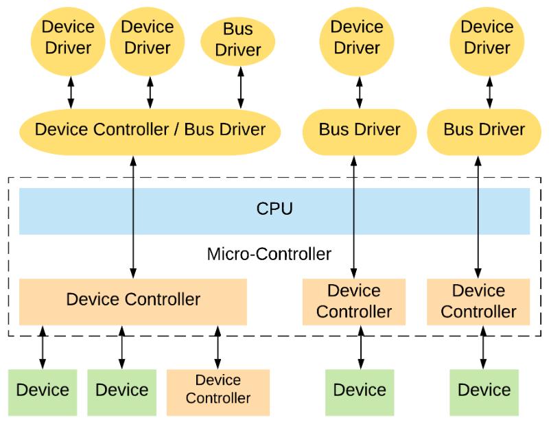
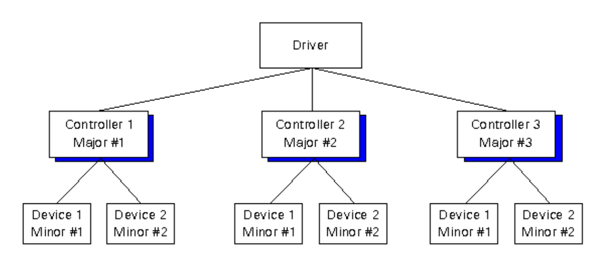

<h1 align="center">📘 Universidad Nacional de Córdoba</h1>

<p align="center">
  
</p>

---

<h3 align="center">💻 SISTEMAS DE COMPUTACIÓN</h3>
<h4 align="center">Trabajo Práctico N°5: <em>Device Drivers</em></h4>
<h4 align="center">Grupo: <strong>uWuntu</strong> 🚀</h4>

---

# Introducción

Los *device drivers* en sistemas operativos permiten interactuar con el hardware de una forma sergura y eficiente, creando una abstracción del hardware y proporcionando una interfaz estándar para utilizarlo. En este trabajo se verá el desarrollo de un CDD (Character Device Driver) que permita obtener datos de dos señales externas (o emuladas) con un período de un segundo, y mediante una aplicación a nivel del usuario debemos leer una de ambas señales y graficarlas en función del tiempo, este programa también debe poder indicarle al CDD cuál de las dos señales mostrar.

# Desarrollo

## Driver

Un **driver** o **controlador** es un componente de software que permite que el sistema operativo se comunique con un dispositivo de hardware. Actúa como un traductor entre el sistema y el hardware específico, ocultando detalles del funcionamiento físico y ofreciendo una interfaz uniforme.

<p align="center">
  
</p>

## Device Driver

Un **device driver** o controlador de dispositivo es un software especializado que gestiona un dispositivo de hardware específico. Permite realizar operaciones como lectura, escritura, configuración y control del dispositivo. Proporciona la interfaz necesaria para que el sistema operativo y el dispositivo se entiendan mutuamente.

El *device driver* suele dividirse en dos partes:

- Una parte **específica del hardware**, que contiene el código necesario para interactuar con las características particulares del dispositivo.
- Una parte **específica del sistema operativo**, que traduce las llamadas del sistema en comandos comprensibles por el hardware.

## Device Controller

El **device controller** es un componente de hardware que actúa como intermediario entre el sistema operativo y el dispositivo físico. Su función principal es traducir las instrucciones del driver en señales eléctricas comprensibles para el hardware y gestionar la transferencia de datos con la memoria principal del sistema.

- El *device driver* se comunica con el *device controller* para enviar comandos.
- El *device controller* traduce estos comandos en acciones físicas (por ejemplo, mover el cabezal de un disco).
- Algunos *device controllers* también requieren un driver adicional para su gestión: el **bus driver**.

## Bus Driver

Los buses de hardware son canales de comunicación que interconectan la CPU, la memoria y los dispositivos periféricos (por ejemplo, PCI, USB, I2C, SPI, etc.).

Un **bus driver** es el software responsable de manejar ese canal de comunicación. Coordina:

- El acceso a dispositivos conectados al bus.
- La asignación de recursos compartidos.
- La sincronización de transferencias y señales de control.

Esencialmente, actúa como un puente entre el sistema operativo y el conjunto de dispositivos conectados a un mismo bus.

## Character Device Driver

Un **character device driver (CDD)** gestiona dispositivos que transmiten datos secuencialmente, carácter por carácter (byte a byte), como:

- Puertos serie
- Teclados
- Mouses
- Terminales

A diferencia de los *block device drivers* (que manejan bloques de datos como discos), los *character device drivers* operan en flujos continuos y no estructurados de bytes.

Para acceder a estos dispositivos, se utilizan los **Character Device Files (CDF)**, que son archivos especiales ubicados en el sistema de archivos virtual `/dev`. A través de estos archivos, se pueden enviar comandos y leer datos del dispositivo como si fuera un archivo común.

## Números Major y Minor

<p align="center">
  
</p>

En sistemas tipo Unix, cada dispositivo gestionado por el kernel se representa como un archivo especial en el directorio `/dev`. Estos archivos están identificados por un par de números:

- **Major number**: indica qué driver debe usarse para acceder al dispositivo.
- **Minor number**: diferencia entre múltiples dispositivos gestionados por un mismo driver.

> Por ejemplo, dos discos duros manejados por el mismo driver tendrán el mismo major number, pero diferentes minor numbers.

Estos números permiten que el sistema distinga entre diferentes instancias de dispositivos sin necesidad de identificadores complejos.

> Para ver estos números en un sistema Unix/Linux, se puede usar el comando:
> ```
> ls -l /dev
> ```
> En la salida, los archivos de dispositivo aparecen con una `b` (block) o `c` (character) en la primera columna, y los números major y minor en la quinta y sexta columna, respectivamente.

## Diseño de un CDD para Adquisición de Señales

# Bibliografía

 [Emulador Raspberry-pi](https://pypi.org/project/qemu-rpi-gpio/?authuser=1)
