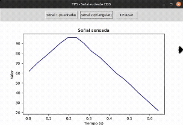

<h1 align="center">📘 Universidad Nacional de Córdoba</h1>

<p align="center">
  
</p>

---

<h3 align="center">💻 SISTEMAS DE COMPUTACIÓN</h3>
<h4 align="center">Trabajo Práctico N°5: <em>Device Drivers</em></h4>
<h4 align="center">Grupo: <strong>uWuntu</strong> 🚀</h4>

---

# Introducción

Los **device drivers** en sistemas operativos permiten interactuar con el hardware de una forma segura y eficiente, creando una abstracción del hardware y proporcionando una interfaz estándar para utilizarlo. En este trabajo se verá el desarrollo de un **CDD (Character Device Driver)** que permita obtener datos de dos señales externas (o emuladas) con un período de un segundo, y mediante una aplicación a nivel del usuario debemos leer una de ambas señales y graficarlas en función del tiempo, este programa también debe poder indicarle al CDD cuál de las dos señales mostrar.

# Desarrollo

## Driver

Un **driver** o **controlador** es un componente de software que permite que el sistema operativo se comunique con un dispositivo de hardware. Actúa como un traductor entre el sistema y el hardware específico, ocultando detalles del funcionamiento físico y ofreciendo una interfaz uniforme.

<p align="center">
  
</p>

<p align="center"><b>Fig 1.</b> Relación entre drivers, controladores de dispositivos y buses.</p>

## Device Driver

Un **device driver** o controlador de dispositivo es un software especializado que gestiona un dispositivo de hardware específico. Permite realizar operaciones como lectura, escritura, configuración y control del dispositivo. Proporciona la interfaz necesaria para que el sistema operativo y el dispositivo se entiendan mutuamente.

El *device driver* suele dividirse en dos partes:

- Una parte **específica del hardware**, que contiene el código necesario para interactuar con las características particulares del dispositivo.
- Una parte **específica del sistema operativo**, que traduce las llamadas del sistema en comandos comprensibles por el hardware.

## Device Controller

El **device controller** es un componente de hardware que actúa como intermediario entre el sistema operativo y el dispositivo físico. Su función principal es traducir las instrucciones del driver en señales eléctricas comprensibles para el hardware y gestionar la transferencia de datos con la memoria principal del sistema.

- El *device driver* se comunica con el *device controller* para enviar comandos.
- El *device controller* traduce estos comandos en acciones físicas (por ejemplo, mover el cabezal de un disco).
- Algunos *device controllers* también requieren un driver adicional para su gestión: el **bus driver**.

## Bus Driver

Los buses de hardware son canales de comunicación que interconectan la CPU, la memoria y los dispositivos periféricos (por ejemplo, PCI, USB, I2C, SPI, etc.).

Un **bus driver** es el software responsable de manejar ese canal de comunicación. Coordina:

- El acceso a dispositivos conectados al bus.
- La asignación de recursos compartidos.
- La sincronización de transferencias y señales de control.

Esencialmente, actúa como un puente entre el sistema operativo y el conjunto de dispositivos conectados a un mismo bus.

## Character Device Driver

Un **character device driver (CDD)** gestiona dispositivos que transmiten datos secuencialmente, carácter por carácter (byte a byte), como:

- Puertos serie
- Teclados
- Mouses
- Terminales

A diferencia de los *block device drivers* (que manejan bloques de datos como discos), los *character device drivers* operan en flujos continuos y no estructurados de bytes.

Para acceder a estos dispositivos, se utilizan los **Character Device Files (CDF)**, que son archivos especiales ubicados en el sistema de archivos virtual `/dev`. A través de estos archivos, se pueden enviar comandos y leer datos del dispositivo como si fuera un archivo común.

## Números Major y Minor

<p align="center">
  
</p>

<p align="center"><b>Fig 2.</b> Organización de dispositivos por número major y minor.</p>

En sistemas tipo Unix, cada dispositivo gestionado por el kernel se representa como un archivo especial en el directorio `/dev`. Estos archivos están identificados por un par de números:

- **Major number**: indica qué driver debe usarse para acceder al dispositivo.
- **Minor number**: diferencia entre múltiples dispositivos gestionados por un mismo driver.

> **Ejemplo:** Dos discos duros manejados por el mismo driver tendrán el mismo major number, pero diferentes minor numbers.

Estos números permiten que el sistema distinga entre diferentes instancias de dispositivos sin necesidad de identificadores complejos.

> **Nota:** Para ver estos números en un sistema Unix/Linux, se puede usar el comando:
> ```bash
> ls -l /dev
> ```
> En la salida, los archivos de dispositivo aparecen con una `b` (block) o `c` (character) en la primera columna, y los números major y minor en la quinta y sexta columna, respectivamente.

## Diseño de un CDD para Adquisición de Señales

### Etapa 1: Desarrollo del Character Device Driver (`tp5_driver.c`)

El objetivo de este TP es construir un **Character Device Driver (CDD)** que simule dos señales con período de un segundo y escribir una aplicación de usuario que debe poder:

- Seleccionar cuál señal leer.
- Leer valores periódicos.
- Graficar dichos valores.

#### Conceptos aplicados desde la bibliografía

Desde la presentación, se implementaron:

- **Modelo de capas de un CDD**: `Application → CDF (/dev) → CDD → Kernel space`.
- Uso de `alloc_chrdev_region`, `cdev_init`, `cdev_add`, `class_create`, `device_create`, y `file_operations` para integrar el módulo al sistema.
- Conexión entre CDF y CDD a través del número `major/minor`.
- Lógica de temporización en el kernel con `timer_list`.

#### Inspiración en ejemplos base

El desarrollo de `tp5_driver.c` se construyó gradualmente tomando como referencia directa los archivos de ejemplo provistos en la clase práctica. Cada uno aportó elementos para componer el diseño completo del driver.

##### 🔹 `drv1.c` – *Inicialización mínima de un módulo*

Este ejemplo mostró cómo definir las funciones básicas `tp5_init()` y `tp5_exit()` e incorporarlas con las macros `module_init()` y `module_exit()`. También ilustró el uso de `printk()` para loguear eventos como la carga y descarga del módulo.

> Este patrón fue la base para comenzar la estructura del TP5. Todas las funciones del driver quedaron encapsuladas entre `tp5_init` y `tp5_exit`.

##### 🔹 `drv2.c` – *Registro de número de dispositivo y creación de clase*

Se introdujo el uso de `alloc_chrdev_region()` para reservar un número mayor:menor dinámico. También se mostró cómo crear una clase (`class_create()`) que permita que `udev` genere automáticamente el archivo en `/dev/`.

> En el TP se usaron exactamente estas funciones para crear `/dev/tp5_driver` de forma automática, sin necesidad de usar `mknod`.

##### 🔹 `drv3.c` – *Integración con el sistema de archivos y operaciones básicas*

Este archivo presentó la estructura `file_operations`, que permite al kernel saber qué funciones deben ejecutarse al hacer `read()`, `write()`, `open()` o `release()` desde el espacio de usuario. También mostró el uso de `device_create()` para que el dispositivo aparezca en `/dev/` y pueda ser accedido como un archivo.

> En `tp5_driver.c`, se reutilizó esta estructura y se implementaron las funciones `my_read`, `my_write`, `my_open` y `my_close` para definir la interfaz con el usuario.

##### 🔹 `drv4.c` – *Interacción con el espacio de usuario*

Este ejemplo introdujo funciones esenciales para cualquier driver de carácter: `copy_to_user()` y `copy_from_user()`, las cuales permiten transferir datos entre el kernel space y user space de forma segura.

> Estas funciones fueron fundamentales para implementar `my_read()` (que devuelve el valor de la señal activa) y `my_write()` (que permite al usuario seleccionar qué señal quiere leer).

##### 🔹 `clipboard.c` – *Manejo de buffers y diseño práctico*

Este ejemplo más completo permitió entender cómo gestionar datos dinámicos dentro del kernel y cómo mantener un buffer coherente entre llamadas. Aunque en el TP no se necesitó un buffer complejo, sirvió como referencia conceptual para mantener el valor de la señal seleccionada en `active_signal`.

> Además, mostró cómo una aplicación puede interactuar periódicamente con un dispositivo de carácter, base para lo que luego se implementó en `tp5_console.py` y `tp5_gui.py`.

#### Conceptos aplicados desde la bibliografía

##### Modelo de capas de un CDD

Se aplicó el modelo:

```
Application → Character Device File (/dev/tp5_driver) → Character Device Driver → Kernel space
```

Esto permite una separación clara entre la aplicación de usuario (por ejemplo, un programa en Python) y la lógica interna del kernel.

##### Creación completa del CDD

Se utilizaron todos los componentes que la presentación indica para un módulo de carácter completo:

- `alloc_chrdev_region()` → Reserva de número de dispositivo
- `class_create()` / `device_create()` → Entrada automática en `/dev`
- `cdev_init()` / `cdev_add()` → Registro de operaciones
- `file_operations` → Asociación con funciones de `read`, `write`, etc.

##### Temporización en el espacio de kernel

El uso de `struct timer_list` y la función `mod_timer()` con `jiffies` y `HZ` permitió generar señales periódicas **sin usar interrupciones externas ni hardware físico**, exactamente como propone el TP.

### Etapa 2: Instalación y prueba del CDD

#### Compilación del driver

Para compilar el archivo `tp5_driver.c`, se utilizó un `Makefile` estándar como se aprendió en clase y en los ejemplos, siguiendo la estructura:

```makefile
obj-m += tp5_driver.o

all:
    make -C /lib/modules/$(shell uname -r)/build M=$(PWD) modules

clean:
    make -C /lib/modules/$(shell uname -r)/build M=$(PWD) clean
```

Este `Makefile` compila el módulo como `tp5_driver.ko`.

#### Carga del módulo

Una vez compilado, se cargó con:

```bash
sudo insmod tp5_driver.ko
```

Y se verificó con:

```bash
dmesg | tail
```

Esto imprime la línea:

```
tp5_driver: módulo cargado
```

#### Creación del archivo de dispositivo y asignación de permisos

Debido al uso de `class_create()` y `device_create()` en el código, el sistema `udev` crea automáticamente el archivo `/dev/tp5_driver`.

Si no aparece, puede crearse manualmente:

```bash
sudo mknod /dev/tp5_driver c <major> 0
```

Donde `<major>` se obtiene con:

```bash
cat /proc/devices | grep tp5_driver
```

Independientemente, debemos configurar permisos de lectura y escritura sobre el archivo para poder seleccionar la señal y observar su información a través de la aplicación en python de más adelante:

```bash
sudo chmod 666 /dev/tp5_driver
```

#### Prueba básica desde consola

Se probó que el driver respondiera correctamente:

##### Selección de señal

```bash
echo "1" > /dev/tp5_driver  # Selecciona la señal cuadrada
echo "2" > /dev/tp5_driver  # Selecciona la señal triangular
```

##### Lectura de valor

```bash
cat /dev/tp5_driver
```

Se observaron los valores `0` y `1` alternando cada 0.5 segundos para la señal cuadrada.

Para la señal triangular, se observan valores entre 0 y 100 que suben y bajan suavemente.

#### Verificación vía logs del kernel

Cada operación `open`, `read`, `write`, `close` es registrada con `printk()`:

```bash
dmesg | tail
```

Esto ayuda a depurar y confirmar que las funciones se activan correctamente, como también se aprendió en `drv3.c` y `drv4.c`.

#### Conclusión Etapa 2

El driver se cargó, creó el archivo en `/dev`, respondió a lectura y escritura, y fue verificado correctamente desde consola. Esto demuestra que el `tp5_driver.c` funciona como un **CDD real, siguiendo el modelo propuesto en la bibliografía**.

### Etapa 3: Desarrollo y uso de la aplicación de consola (`tp5_console.py`)

El script `tp5_console.py` fue desarrollado como una **interfaz de usuario en consola** que permite:

- Seleccionar la señal activa (cuadrada o triangular).
- Leer valores periódicamente desde `/dev/tp5_driver`.
- Mostrar los valores junto al tiempo transcurrido.

Este script permite verificar el correcto funcionamiento del driver **sin interfaz gráfica**, útil para depuración directa en terminal.

#### Estructura del código

1. **Selección de señal:**
   - El usuario elige `"1"` o `"2"`, y el script escribe ese valor en `/dev/tp5_driver`.
   - Inspirado en la mecánica de `write()` de `drv4.c`, donde se copia un valor del espacio de usuario al kernel.

2. **Lectura de señal:**
   - El valor leído con `cat /dev/tp5_driver` es simulado en Python con `open(..., "r")`.
   - Cada lectura se acompaña de un timestamp calculado con `time.time()`.

3. **Loop de adquisición:**
   - El script entra en un bucle que lee una vez por segundo (con `time.sleep(1)`) e imprime:
     ```text
     [1.0 s] Valor: 0
     [2.0 s] Valor: 1
     ```
   - Se puede interrumpir con `Ctrl+C`, lo que devuelve al menú de selección.

#### Interacción con el driver

- La comunicación con el `tp5_driver` se realiza como si fuese un archivo de texto.
- Este diseño aplica el principio UNIX de "todo es un archivo", promovido por el sistema de archivos virtual (VFS) del kernel.

#### Ejemplo de uso

```bash
python3 tp5_console.py
```

```
Seleccionar señal [1] cuadrada / [2] triangular / [q] salir: 2
Leyendo Señal 2 (Ctrl+C para volver al menú)...

[0.0 s] Valor: 0
[1.0 s] Valor: 40
[2.0 s] Valor: 80
[3.0 s] Valor: 60
...
```

#### Valor del script

- Permite testear desde shell, sin entorno gráfico.
- Útil para pruebas remotas o automatización de tests.
- Valida que la lógica del driver responde correctamente a `read()` y `write()`.

#### Inspiración teórica

La estructura general del script se alinea con el flujo descrito en la bibliografía:

> "*Application → Character Device File (/dev) → CDD → Señal Kernel*".

Además, refuerza la idea de que un CDD proporciona una interfaz simple y predecible para las aplicaciones de usuario, desacoplando totalmente la lógica del espacio de kernel del entorno gráfico o textual.

### Etapa 4: Desarrollo y uso de la aplicación gráfica (`tp5_gui.py`)

El archivo `tp5_gui.py` implementa una **interfaz gráfica en Python con Tkinter y Matplotlib** que permite:

- Seleccionar entre la señal cuadrada y la triangular.
- Leer continuamente los valores de la señal activa desde `/dev/tp5_driver`.
- Graficar esos valores en tiempo real.
- Pausar, reanudar y reiniciar el gráfico.

#### Estructura funcional

1. **Interfaz de usuario (GUI):**
   - Dos botones: `Señal 1 (cuadrada)` y `Señal 2 (triangular)` permiten enviar `"1"` o `"2"` al driver (`write()`).
   - Botón de pausa `"⏸️ Pausar"` para detener temporalmente el graficado sin cerrar la app.

2. **Lógica de adquisición de datos:**
   - Un hilo (`threading.Thread`) ejecuta `update_loop()` en segundo plano.
   - La función `read_signal()` lee de `/dev/tp5_driver` cada **20 ms** (`update_interval = 0.02`), sincronizado con el ciclo del driver.

3. **Graficación con Matplotlib:**
   - Los valores se almacenan en listas `signal_data` y `time_data`.
   - Se grafican en vivo sobre un canvas embebido en la ventana Tkinter.
   - Se mantiene una ventana móvil de 20 segundos de datos.

4. **Manejo del buffer:**
   - Para evitar saturación de memoria, se limitan los puntos a `20 / interval` (por defecto: 1000 puntos si interval = 0.02).

#### Ejemplo de uso

```bash
python3 tp5_gui.py
```

Se abre una ventana con:

- Botones para cambiar la señal.
- Ejes `tiempo (s)` vs `valor`.
- Un gráfico en vivo que muestra la forma de onda correspondiente.

#### Comprobación del funcionamiento del driver

- La GUI permite **observar visualmente** si la señal cuadrada alterna cada 0.5 segundos y si la triangular forma una onda simétrica de 1s de período.
- Se identificaron cortes o irregularidades mediante la inspección gráfica y se corrigieron ajustando:
  - El `update_interval` en Python.
  - El `timer_list` en el kernel.
  - El filtrado de datos (evitar saltos anómalos).

#### Inspiración y fundamentos

Desde la bibliografía:

- La idea de ofrecer una **interfaz de usuario desacoplada** del kernel es una consecuencia directa del modelo de capas que define:
  > `Application → /dev → driver → kernel → dispositivo lógico (en este caso, señales virtuales)`

- Además, nos inspiramos en el ejercicio `clipboard.c`, que muestra cómo mapear un archivo especial para comunicar datos entre kernel y espacio de usuario.

- La aplicación también pone en práctica lo indicado en la consigna del TP:
  > "Una aplicación a nivel de usuario deberá leer UNA de las dos señales y graficarla en función del tiempo."

### Conclusión Etapa 4

La aplicación `tp5_gui.py` demuestra la utilidad de un Character Device Driver como **interfaz simple y efectiva para graficar señales simuladas desde el kernel**.

<p align="center">
  
</p>

<p align="center"><b>Fig 3.</b> Interfaz gráfica mostrando la señal triangular sensada desde el CDD.</p>

Esta etapa integra los conocimientos de desarrollo de drivers en espacio kernel con técnicas de visualización en espacio de usuario. Se validó la comunicación entre el módulo del kernel (CDD) y la aplicación Python mediante operaciones estándar de lectura de archivos (`read()`), lo que permite construir herramientas eficientes sin necesidad de mecanismos complejos como sockets o memoria compartida.

Además, la experiencia demuestra que es posible controlar en tiempo real qué señal visualizar desde el espacio de usuario, escribiendo la selección al archivo de dispositivo, lo cual confirma la correcta implementación del manejo de entradas en el driver.

---

# Bibliografía

- [Diapositivas de Clase](https://docs.google.com/presentation/d/14_B_0JEsK976efErZ9z_GjIdlJzpougZzb1cdS97S3c/edit?slide=id.p#slide=id.p)
- [Repositorio de Referencia](https://gitlab.com/sistemas-de-computacion-unc/device-drivers/?authuser=1)